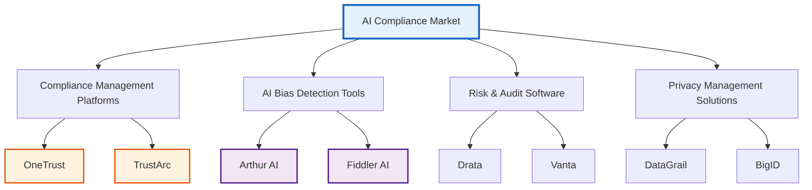
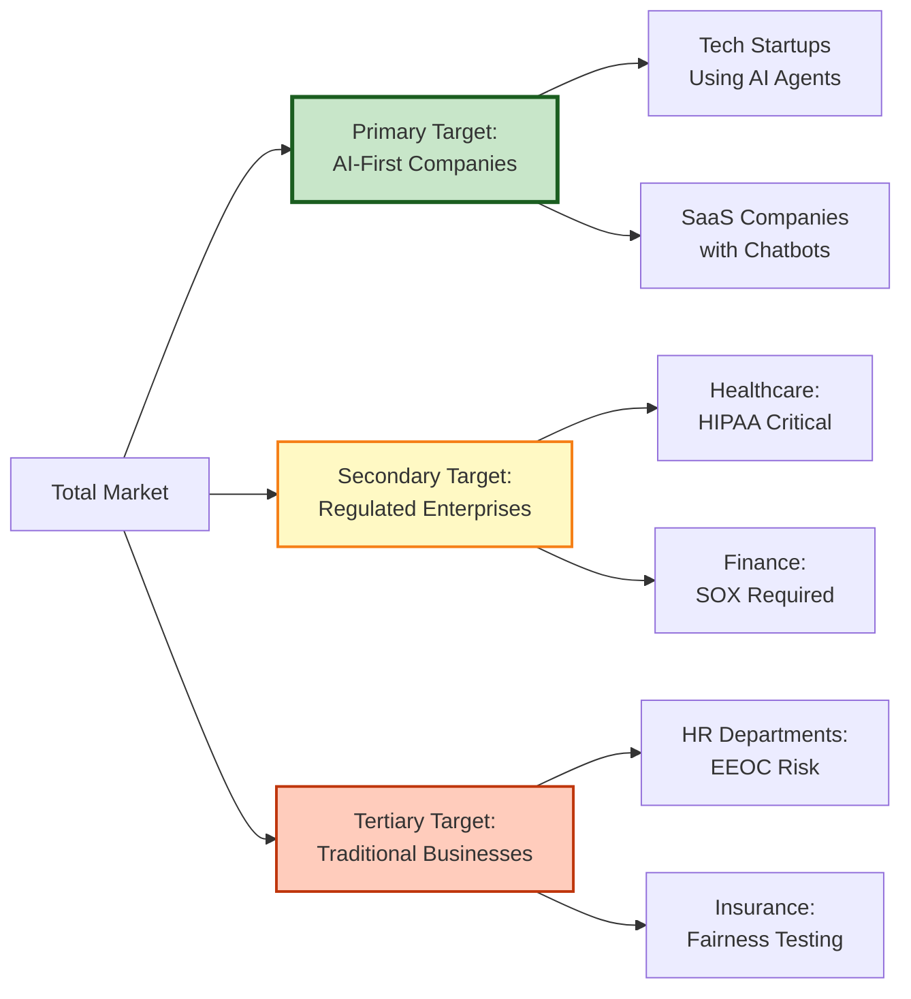

# Competitive Landscape Analysis

**ComplyGuard-AI Market Positioning**  
**Last Updated:** December 23, 2025  
**Market:** AI Compliance Testing & Monitoring

---

## 🎯 EXECUTIVE SUMMARY

ComplyGuard-AI operates in the **emerging AI compliance testing market**, positioned at the intersection of:
- AI Safety & Ethics Tools
- Compliance Management Platforms
- Risk Assessment Software
- Enterprise Governance Solutions

**Market Size:** AI compliance/governance market projected to reach **$2.3B by 2027** (Gartner, 2024), driven by regulatory enforcement and enterprise AI adoption.

**Key Differentiators:**
1. ✅ **AI-native solution** - Built with Gemini 3 Pro vs. legacy rule-based systems
2. ✅ **Pre-deployment testing focus** - Catches violations before launch vs. post-deployment monitoring
3. ✅ **24-hour build time** - Proof of rapid innovation vs. 5+ year development cycles
4. ✅ **Multi-framework coverage** - Simultaneous GDPR/HIPAA/EEOC/SOX testing vs. single-domain tools

---

## 🏢 COMPETITIVE LANDSCAPE OVERVIEW

### Market Categories

---

## 🔍 COMPETITOR DEEP DIVE

### 1️⃣ OneTrust (Compliance Management Leader)

**Company Profile:**
- **Founded:** 2016
- **Valuation:** $5.3B (2021)
- **Employees:** 2,000+
- **Headquarters:** Atlanta, GA

**Product Suite:**
- Privacy Management (GDPR, CCPA)
- Data Discovery & Mapping
- Risk & Compliance Automation
- AI Governance (added 2023)

**Strengths:**
- ✅ Enterprise adoption (10,000+ customers)
- ✅ Comprehensive platform (30+ modules)
- ✅ Strong brand recognition
- ✅ Extensive integrations (Salesforce, ServiceNow)

**Weaknesses:**
- ❌ High cost ($50K+ annual licenses)
- ❌ Complex implementation (6-12 months)
- ❌ Legacy architecture (not AI-native)
- ❌ Focused on data privacy > AI agent testing

**How ComplyGuard-AI Compares:**
| Feature | OneTrust | ComplyGuard-AI |
|---------|----------|----------------|
| **AI Agent Testing** | Limited | ✅ Core Focus |
| **Implementation Time** | 6-12 months | Minutes (AI Studio) |
| **Cost** | $50K+/year | Phase 2: $5K-$20K/year |
| **AI-Native** | ❌ No | ✅ Yes (Gemini 3) |
| **Pre-Deployment Testing** | ❌ No | ✅ Yes |

**Market Position:** Enterprise-focused, broad compliance vs. our AI agent specialization

---

### 2️⃣ TrustArc (Privacy & Risk Management)

**Company Profile:**
- **Founded:** 1997 (as TRUSTe)
- **Funding:** $70M+
- **Employees:** 300+
- **Headquarters:** San Francisco, CA

**Product Focus:**
- Privacy compliance (GDPR, CCPA, LGPD)
- Risk assessments
- Data inventory management
- Cookie consent tools

**Strengths:**
- ✅ Long track record (28 years)
- ✅ Privacy expertise
- ✅ Assessment frameworks
- ✅ Certification programs

**Weaknesses:**
- ❌ Not AI-focused (traditional privacy only)
- ❌ Manual assessment processes
- ❌ No real-time testing capabilities
- ❌ Expensive consulting model

**How ComplyGuard-AI Compares:**
| Feature | TrustArc | ComplyGuard-AI |
|---------|----------|----------------|
| **Real-Time Testing** | ❌ Manual | ✅ Automated |
| **AI Bias Detection** | ❌ No | ✅ Yes (EEOC) |
| **Multi-Framework** | ❌ Privacy only | ✅ GDPR/HIPAA/EEOC/SOX |
| **Setup Time** | Weeks | Minutes |

**Market Position:** Traditional privacy consultancy vs. our automated AI testing

---

### 3️⃣ Arthur AI (AI Monitoring & Explainability)

**Company Profile:**
- **Founded:** 2018
- **Funding:** $64M (Series B, 2022)
- **Employees:** 100+
- **Headquarters:** New York, NY

**Product Focus:**
- Model monitoring (drift, performance)
- Explainability (SHAP, LIME)
- Bias detection
- Anomaly detection

**Strengths:**
- ✅ AI-native platform
- ✅ MLOps integration
- ✅ Technical depth (ML expertise)
- ✅ Real-time monitoring

**Weaknesses:**
- ❌ Post-deployment only (no pre-launch testing)
- ❌ Requires ML expertise to operate
- ❌ Focused on models, not agent outputs
- ❌ No regulatory framework mapping (GDPR, HIPAA)

**How ComplyGuard-AI Compares:**
| Feature | Arthur AI | ComplyGuard-AI |
|---------|-----------|----------------|
| **Pre-Deployment Testing** | ❌ No | ✅ Yes |
| **Regulatory Frameworks** | ❌ Generic bias | ✅ GDPR/HIPAA/EEOC/SOX |
| **User Friendliness** | ❌ ML expertise needed | ✅ Business user-friendly |
| **Agent Output Testing** | ❌ No | ✅ Core feature |

**Market Position:** ML monitoring for data scientists vs. our compliance testing for business users

---

### 4️⃣ Fiddler AI (ML Model Performance)

**Company Profile:**
- **Founded:** 2018
- **Funding:** $102M (Series C, 2022)
- **Employees:** 150+
- **Headquarters:** Palo Alto, CA

**Product Focus:**
- Model explainability
- Performance monitoring
- Fairness analytics
- Data quality checks

**Strengths:**
- ✅ Strong technical capabilities
- ✅ Enterprise customers (banks, healthcare)
- ✅ Fairness metrics
- ✅ Integration with ML pipelines

**Weaknesses:**
- ❌ Model-centric (not agent output testing)
- ❌ No compliance framework alignment
- ❌ Requires technical integration
- ❌ Post-deployment focus

**How ComplyGuard-AI Compares:**
| Feature | Fiddler AI | ComplyGuard-AI |
|---------|------------|----------------|
| **Compliance Testing** | ❌ No | ✅ Yes |
| **Agent Testing** | ❌ No | ✅ Yes |
| **Business User Focus** | ❌ Technical | ✅ Business-friendly |
| **Regulatory Mapping** | ❌ No | ✅ GDPR/HIPAA/EEOC/SOX |

**Market Position:** ML performance tool vs. our business compliance solution

---

### 5️⃣ Drata (SOC 2 Compliance Automation)

**Company Profile:**
- **Founded:** 2020
- **Valuation:** $2B (2022)
- **Employees:** 300+
- **Headquarters:** San Diego, CA

**Product Focus:**
- SOC 2 compliance automation
- ISO 27001, HIPAA, GDPR
- Continuous monitoring
- Evidence collection

**Strengths:**
- ✅ Rapid growth (unicorn status)
- ✅ Automation focus
- ✅ Developer-friendly
- ✅ Multi-framework support

**Weaknesses:**
- ❌ Infrastructure compliance (not AI agent testing)
- ❌ No AI-specific capabilities
- ❌ Focused on systems, not outputs
- ❌ No bias/discrimination detection

**How ComplyGuard-AI Compares:**
| Feature | Drata | ComplyGuard-AI |
|---------|-------|----------------|
| **AI Agent Testing** | ❌ No | ✅ Core feature |
| **Output Compliance** | ❌ No | ✅ Yes |
| **Bias Detection** | ❌ No | ✅ EEOC testing |
| **Focus Area** | Infrastructure | AI Agent Outputs |

**Market Position:** System compliance vs. our AI output compliance

---

### 6️⃣ Vanta (Security & Compliance)

**Company Profile:**
- **Founded:** 2018
- **Valuation:** $2.45B (2023)
- **Employees:** 400+
- **Headquarters:** San Francisco, CA

**Product Focus:**
- SOC 2, ISO 27001, HIPAA automation
- Security questionnaire automation
- Vendor risk management
- Trust center

**Strengths:**
- ✅ Strong brand (Y Combinator alumni)
- ✅ Developer adoption
- ✅ Fast implementation
- ✅ Competitive pricing

**Weaknesses:**
- ❌ Security/infrastructure focus
- ❌ No AI testing capabilities
- ❌ No content analysis
- ❌ System-level, not output-level

**How ComplyGuard-AI Compares:**
| Feature | Vanta | ComplyGuard-AI |
|---------|-------|----------------|
| **AI Output Testing** | ❌ No | ✅ Yes |
| **Content Analysis** | ❌ No | ✅ Gemini 3 Pro |
| **Compliance Scope** | Infrastructure | AI Agent Behavior |

**Market Position:** Infrastructure compliance vs. our AI behavior compliance

---

## 📊 COMPETITIVE MATRIX

### Feature Comparison

| Capability | OneTrust | TrustArc | Arthur AI | Fiddler AI | Drata | Vanta | **ComplyGuard-AI** |
|------------|----------|----------|-----------|------------|-------|-------|-------------------|
| **Pre-Deployment Testing** | ❌ | ❌ | ❌ | ❌ | ❌ | ❌ | ✅ |
| **AI Agent Output Testing** | ❌ | ❌ | ⚠️ Models only | ⚠️ Models only | ❌ | ❌ | ✅ |
| **GDPR Compliance** | ✅ | ✅ | ❌ | ❌ | ✅ | ✅ | ✅ |
| **HIPAA Compliance** | ✅ | ✅ | ❌ | ❌ | ✅ | ✅ | ✅ |
| **EEOC Bias Testing** | ❌ | ❌ | ⚠️ Generic | ⚠️ Generic | ❌ | ❌ | ✅ |
| **SOX Compliance** | ✅ | ❌ | ❌ | ❌ | ⚠️ Indirect | ⚠️ Indirect | ✅ |
| **Real-Time Analysis** | ❌ | ❌ | ✅ | ✅ | ⚠️ Monitoring | ⚠️ Monitoring | ✅ |
| **AI-Native Platform** | ❌ | ❌ | ✅ | ✅ | ❌ | ❌ | ✅ |
| **Multi-Framework Testing** | ✅ | ⚠️ Privacy only | ❌ | ❌ | ✅ | ✅ | ✅ |
| **Implementation Time** | 6-12 months | 4-8 weeks | 2-4 weeks | 2-4 weeks | 1-2 weeks | 1-2 weeks | **Minutes** |
| **Annual Cost** | $50K-$200K | $30K-$100K | $25K-$75K | $30K-$80K | $15K-$50K | $12K-$40K | **$5K-$20K** (Phase 2) |

**Legend:**  
✅ Full Support | ⚠️ Partial Support | ❌ Not Supported

---

## 🎯 COMPLYGUARD-AI COMPETITIVE ADVANTAGES

### 1. **Pre-Deployment Testing Focus**

**The Gap:** All competitors focus on post-deployment monitoring or infrastructure compliance. None test AI agent outputs **before launch**.

**Our Edge:** 
- Test outputs during development
- Catch violations before customers see them
- Prevent Air Canada-style lawsuits proactively

**Market Impact:** Shift from "detect & remediate" to "test & prevent" model

---

### 2. **AI-Native Architecture**

**The Gap:** OneTrust, TrustArc, Drata, Vanta use legacy rule-based systems.

**Our Edge:**
- Built with Gemini 3 Pro multimodal reasoning
- Context-aware violation detection (catches implied bias)
- Understands nuance (e.g., "older employees struggle" = age discrimination)

**Technical Advantage:** Can detect violations traditional regex patterns miss

---

### 3. **Multi-Framework Simultaneous Testing**

**The Gap:** Competitors focus on single domains (privacy OR bias OR security).

**Our Edge:**
- Test GDPR + HIPAA + EEOC + SOX simultaneously
- Catch cross-framework violations (e.g., SSN + medical diagnosis = GDPR + HIPAA)
- Single test, comprehensive results

**Efficiency Gain:** 4x faster than testing frameworks separately

---

### 4. **24-Hour Build Proof**

**The Gap:** Competitors took 5+ years to build platforms.

**Our Edge:**
- Built MVP in 24 hours (Kaggle submission)
- Demonstrates Gemini 3 Pro power
- Agile iteration vs. slow enterprise development

**Strategic Value:** Proves rapid innovation capability

---

### 5. **Industry-Specific Samples**

**The Gap:** Competitors provide generic tools without industry context.

**Our Edge:**
- Pre-built prompts for Healthcare, Finance, HR, Insurance
- Industry-specific violation examples
- Faster time-to-value for users

**Adoption Benefit:** No learning curve for domain experts

---

### 6. **Business User-Friendly**

**The Gap:** Arthur AI, Fiddler require ML expertise to operate.

**Our Edge:**
- No coding required
- Clear compliance scores (0-100)
- Plain-language violation explanations
- Compliant version generation

**Market Expansion:** Accessible to compliance officers, not just data scientists

---

## 💰 PRICING COMPARISON

### Current Market Pricing

| Vendor | Entry Tier | Mid Tier | Enterprise | Setup Fee |
|--------|------------|----------|------------|-----------|
| **OneTrust** | $50K/year | $120K/year | $200K+/year | $25K-$50K |
| **TrustArc** | $30K/year | $60K/year | $100K+/year | $15K-$30K |
| **Arthur AI** | $25K/year | $50K/year | $75K+/year | $10K-$20K |
| **Fiddler AI** | $30K/year | $55K/year | $80K+/year | $10K-$20K |
| **Drata** | $15K/year | $30K/year | $50K/year | $2K-$5K |
| **Vanta** | $12K/year | $25K/year | $40K/year | $1K-$3K |

### ComplyGuard-AI Pricing Strategy (Phase 2)

**Disruptive Pricing Model:**

| Tier | Price | Tests/Month | Features | Target |
|------|-------|-------------|----------|--------|
| **Starter** | $5K/year | 1,000 | 2 frameworks, email support | Startups, SMBs |
| **Professional** | $12K/year | 10,000 | 4 frameworks, API access | Mid-market |
| **Enterprise** | $20K/year | Unlimited | Custom frameworks, dedicated support | Large enterprises |

**Pricing Advantage:** 60-75% cheaper than competitors while offering AI-native capabilities

---

## 🚀 MARKET POSITIONING STRATEGY

### Target Market Segmentation

### Positioning Statement

**For** enterprise AI teams deploying conversational agents  
**Who** need to prevent regulatory violations before launch  
**ComplyGuard-AI** is an AI-native compliance testing platform  
**That** catches GDPR, HIPAA, EEOC, and SOX violations in agent outputs  
**Unlike** OneTrust, TrustArc, or Arthur AI  
**We** test outputs pre-deployment using Gemini 3 Pro multimodal reasoning

---

## 🎪 GO-TO-MARKET DIFFERENTIATION

### Key Messaging

**Headline:** *"Test AI Compliance Before Your Customers Do"*

**Core Messages:**
1. **Prevention Over Detection** - "Catch violations before deployment, not after lawsuits"
2. **AI-Native Solution** - "Built with Gemini 3 Pro, not legacy rules engines"
3. **Multi-Framework Coverage** - "One test, four compliance frameworks (GDPR/HIPAA/EEOC/SOX)"
4. **Rapid Implementation** - "Live in minutes, not months"

### Competitive Win Themes

**vs. OneTrust:**
- ✅ 10x faster implementation (minutes vs. 6-12 months)
- ✅ 75% lower cost ($5K vs. $50K+)
- ✅ AI agent focus (not generic data privacy)

**vs. Arthur AI / Fiddler AI:**
- ✅ Pre-deployment testing (not post-deployment monitoring)
- ✅ Business user-friendly (no ML expertise required)
- ✅ Regulatory framework alignment (GDPR/HIPAA, not generic bias)

**vs. Drata / Vanta:**
- ✅ AI output compliance (not infrastructure compliance)
- ✅ Content analysis (Gemini 3 Pro reasoning)
- ✅ Agent behavior testing (not system configuration)

---

## 🌍 GEOGRAPHIC MARKET OPPORTUNITIES

### Primary Markets

**1. United States**
- Strong HIPAA enforcement (healthcare)
- EEOC litigation risk (employment)
- SOX requirements (public companies)
- Mature AI adoption

**2. European Union**
- GDPR enforcement active (€20M fines)
- AI Act compliance (2025+)
- High data privacy awareness
- Enterprise AI adoption growing

**3. United Arab Emirates**
- NDMO regulations (UAE-wide)
- DIFC Data Protection Law (Dubai)
- ADGM Data Protection Regulations (Abu Dhabi)
- Hub71 ecosystem support
- Regional expansion hub

---

## 🔮 EMERGING THREATS

### Potential Competitive Responses

**Scenario 1: OneTrust Acquires AI Testing Startup**
- **Probability:** Medium (30%)
- **Timeline:** 12-18 months
- **Our Response:** Emphasize speed-to-market, AI-native advantage

**Scenario 2: Arthur AI Adds Pre-Deployment Testing**
- **Probability:** High (60%)
- **Timeline:** 6-12 months
- **Our Response:** Leverage regulatory framework depth, business user focus

**Scenario 3: New Entrants (OpenAI, Anthropic Build Compliance Tools)**
- **Probability:** Medium (40%)
- **Timeline:** 12-24 months
- **Our Response:** First-mover advantage, industry expertise, multi-framework coverage

### Defensive Strategies

1. **Build Network Effects** - Enterprise case studies, industry partnerships
2. **Expand Framework Coverage** - Add NDMO, DIFC, ADGM (UAE), AI Act (EU)
3. **Deepen Industry Expertise** - Hire compliance specialists per vertical
4. **Create Switching Costs** - API integrations, historical data, custom rules

---

## 📈 COMPETITIVE OUTLOOK

### Market Trajectory

**2025-2026:** Emerging market, few dedicated AI compliance testing tools  
**2027-2028:** Market consolidation begins (OneTrust, TrustArc add capabilities)  
**2029-2030:** Mature market with specialized players

**Our Window:** 18-24 months to establish category leadership before consolidation

### Success Metrics

**Year 1 (2026):**
- 50+ enterprise customers
- $500K ARR
- 3 industry verticals (Healthcare, Finance, HR)

**Year 2 (2027):**
- 200+ enterprise customers
- $2.5M ARR
- 6+ industry verticals
- Strategic partnership or acquisition interest

---

## 🎯 STRATEGIC RECOMMENDATIONS

### Phase 1 (Immediate - Q1 2026)

1. ✅ **Leverage Kaggle Recognition** - If finalist, position as "award-winning"
2. ✅ **Build Case Studies** - Document 3-5 enterprise pilot wins
3. ✅ **Create Comparison Content** - "ComplyGuard-AI vs. OneTrust" guides

### Phase 2 (Q2-Q3 2026)

4. ✅ **Partnership Strategy** - Integrate with Drata/Vanta (complementary, not competitive)
5. ✅ **Thought Leadership** - Publish compliance testing methodology
6. ✅ **Industry Awards** - Apply to Gartner Cool Vendor, Forbes Cloud 100

### Phase 3 (Q4 2026 - 2027)

7. ✅ **Category Creation** - Position "AI Agent Compliance Testing" as new category
8. ✅ **Analyst Relations** - Brief Gartner, Forrester on market need
9. ✅ **Acquisition Strategy** - Either acquire complementary tools OR position for strategic exit

---

## 🔗 RELATED DOCUMENTS

- [docs/enterprise-value.md](enterprise-value.md) - ROI and cost-benefit analysis
- [docs/future-roadmap.md](future-roadmap.md) - Product evolution plan
- [docs/kaggle-timeline.md](kaggle-timeline.md) - Competition status
- [README.md](../README.md) - Product overview

---

**Competitive analysis maintained by:** Repository Manager  
**Next review:** Q2 2026  
**Sources:** Public company data, product websites, industry reports  
**Last Updated:** December 23, 2025
