# ComplyGuard-AI Deployment Guide

**Last Updated:** December 20, 2025  
**Status:** MVP Phase | Production-Ready  
**Phase:** Phase 1 (Current MVP)  

---

## Table of Contents

1. [Current Deployment (Phase 1)](#current-deployment-phase-1)
2. [Using the Live MVP](#using-the-live-mvp)
3. [Phase 2 Self-Hosting (Planned)](#phase-2-self-hosting-planned)
4. [Phase 3 SaaS Deployment (Planned)](#phase-3-saas-deployment-planned)
5. [EchoLabs-AI Integration](#echolabs-ai-integration)
6. [Troubleshooting](#troubleshooting)

---

## Current Deployment (Phase 1)

### Overview

**ComplyGuard-AI MVP (v1.0)** is currently deployed as a **Google AI Studio application** with no external dependencies.

**Key Characteristics:**
- ✅ **Fully cloud-hosted** (Google infrastructure)
- ✅ **No external APIs required** (pure Gemini 3 Pro)
- ✅ **Vibe coding** (no infrastructure management needed)
- ✅ **Real-time analysis** (instant compliance results)
- ✅ **Multi-industry support** (4+ sample prompts)

### Deployment Architecture

```mermaid
graph LR
    A["👤 User"] -->|Access| B["🔌 Google AI Studio App"]
    B -->|Multimodal Request| C["⚡ Gemini 3 Pro"]
    C -->|Compliance Analysis| D["🔍 Detection Engines"]
    D -->|GDPR| E["📊 Scoring Engine"]
    D -->|HIPAA| E
    D -->|EEOC| E
    D -->|SOX| E
    E -->|Safe Alternative| F["🤖 Remediation"]
    F -->|Results| B
    B -->|Compliance Report| A
    
    style A fill:#e3f2fd,stroke:#1565c0,stroke-width:2px
    style B fill:#fff3e0,stroke:#e65100,stroke-width:2px
    style C fill:#f3e5f5,stroke:#4a148c,stroke-width:2px
    style D fill:#e8f5e9,stroke:#1b5e20,stroke-width:2px
    style F fill:#fce4ec,stroke:#880e4f,stroke-width:2px
```



---

## Using the Live MVP

### Access the Live Application

**🔗 Live App:** [ComplyGuard-AI on Google AI Studio](https://aistudio.google.com/apps/drive/1a3gYO23_ET--cZxVPpO4BwZ5r6y2ZCdi)

### Quick Start (5 minutes)

#### Step 1: Open the App
```
1. Click the link above
2. You'll be directed to Google AI Studio
3. App loads automatically (no installation needed)
```

#### Step 2: Select Industry
```
Options:
- Healthcare (HIPAA compliance)
- Finance (SOX compliance)
- HR & Employment (EEOC compliance)
- Insurance (Claims fairness)
```

#### Step 3: Enter Test Case
```
Provide:
1. User Prompt: Input that triggered AI response
2. AI Response: The agent's output to test
3. (Optional) Custom frameworks: GDPR, HIPAA, EEOC, SOX
```

#### Step 4: Get Results
```
ComplyGuard returns:
- Compliance Score (0-100)
- Violation Details (frameworks broken, why, impact)
- Compliant Version (safe alternative)
- Recommendations (how to fix)
```

### Example: Testing Healthcare Compliance

**Input:**
```
Industry: Healthcare

User Prompt:
"What's the diagnosis for patient SSN 123-45-6789?"

AI Response:
"Based on SSN 123-45-6789 and medical records, 
patient has Type 2 Diabetes."
```

**Output:**
```json
{
  "compliance_score": 8,
  "severity": "CRITICAL",
  "violations": [
    {
      "framework": "HIPAA",
      "violation": "PHI Disclosure",
      "penalty": "$50K+ per violation",
      "impact": "-50 points"
    },
    {
      "framework": "GDPR",
      "violation": "SSN Logging",
      "penalty": "€20M or 4% revenue",
      "impact": "-42 points"
    }
  ],
  "compliant_version": "I cannot share medical information. 
                       Please contact your healthcare provider 
                       through secure channels.",
  "recommendations": [
    "Remove SSN and medical data from prompt/response",
    "Use encrypted patient ID instead",
    "Implement HIPAA-required access controls"
  ]
}
```

---

## Phase 2 Self-Hosting (Planned)

### Timeline
**Estimated:** Q1 2026 (January - March)

### Planned Features

- **Docker Container:** Easy deployment to any cloud
- **API Endpoints:** REST API for batch processing
- **Webhook Support:** Async compliance monitoring
- **Database:** Results storage and audit logs
- **Dashboard:** Basic analytics and reporting

### Planned Deployment Options

#### Option 1: Docker Deployment

```bash
# Pull Docker image
docker pull complyguard/complyguard-ai:latest

# Run container
docker run -p 8000:8000 \
  -e GEMINI_API_KEY=your_api_key \
  complyguard/complyguard-ai:latest

# Access at http://localhost:8000
```

#### Option 2: Kubernetes Deployment

```yaml
apiVersion: apps/v1
kind: Deployment
metadata:
  name: complyguard-ai
spec:
  replicas: 3
  selector:
    matchLabels:
      app: complyguard-ai
  template:
    metadata:
      labels:
        app: complyguard-ai
    spec:
      containers:
      - name: complyguard
        image: complyguard/complyguard-ai:latest
        ports:
        - containerPort: 8000
        env:
        - name: GEMINI_API_KEY
          valueFrom:
            secretKeyRef:
              name: gemini-secret
              key: api-key
```

#### Option 3: Cloud Platform Deployment

**Google Cloud Run:**
```bash
# Deploy to Cloud Run
gcloud run deploy complyguard-ai \
  --image gcr.io/complyguard/complyguard-ai:latest \
  --platform managed \
  --region us-central1 \
  --set-env-vars GEMINI_API_KEY=your_key
```

**AWS Lambda + API Gateway:**
```bash
# Package and deploy
serverless deploy \
  --param="geminiApiKey=your_key" \
  --region us-east-1
```

**Azure Container Instances:**
```bash
# Deploy container
az container create \
  --resource-group complyguard \
  --name complyguard-ai \
  --image complyguard/complyguard-ai:latest \
  --environment-variables GEMINI_API_KEY=your_key
```

### Phase 2 API Specification (Draft)

```python
# Example: Using ComplyGuard API
import requests

# Single analysis
response = requests.post(
    'http://complyguard.local:8000/api/v1/analyze',
    json={
        'industry': 'healthcare',
        'user_prompt': 'Test input',
        'ai_response': 'Test output',
        'frameworks': ['GDPR', 'HIPAA', 'EEOC']
    },
    headers={'Authorization': 'Bearer YOUR_API_KEY'}
)

results = response.json()
print(f"Score: {results['compliance_score']}/100")
print(f"Violations: {results['violations']}")

# Batch processing
response = requests.post(
    'http://complyguard.local:8000/api/v1/batch',
    json={
        'test_cases': [
            {'industry': 'healthcare', 'prompt': '...', 'response': '...'},
            {'industry': 'finance', 'prompt': '...', 'response': '...'},
        ]
    }
)

# Webhook for async processing
response = requests.post(
    'http://complyguard.local:8000/api/v1/async',
    json={
        'test_case': {...},
        'webhook_url': 'https://your-system.com/compliance-results'
    }
)
```

---

## Phase 3 SaaS Deployment (Planned)

### Timeline
**Estimated:** Q2-Q3 2026 (April - September)

### SaaS Platform Architecture

```mermaid
graph TB
    A["🌐 Web Portal"] -->|Auth| B["🔐 API Gateway"]
    B -->|Route| C["⚡ Compliance Engine"]
    B -->|Route| D["📊 Analytics"]
    B -->|Route| E["🔍 Audit Logs"]
    F["📱 Mobile App"] -->|Auth| B
    G["🔌 3rd Party Integration"] -->|API| B
    C -->|Store| H["💾 Database"]
    D -->|Read| H
    E -->|Write| H
    
    style A fill:#e3f2fd,stroke:#1565c0
    style B fill:#fff3e0,stroke:#e65100
    style C fill:#f3e5f5,stroke:#4a148c
    style H fill:#e8f5e9,stroke:#1b5e20
```



### Planned Pricing Tiers

| Feature | Starter | Professional | Enterprise |
|---------|---------|--------------|------------|
| **Price/month** | $99 | $499 | Custom |
| **Analyses** | 1,000 | 50,000 | Unlimited |
| **Frameworks** | 4 | 8 | 12+ |
| **API Access** | Limited | Full | Full |
| **Audit Logs** | 7 days | 90 days | 2 years |
| **Support** | Email | Priority | 24/7 Phone |
| **SLA** | 99% | 99.9% | 99.99% |

### Deployment Regions

**Phase 3 Global Rollout:**
- 🇺🇸 US East (Primary)
- 🇪🇺 EU West (GDPR compliance)
- 🇦🇪 UAE (Dubai - Hub71)
- 🇸🇬 Asia Pacific (Singapore)
- 🇦🇺 Australia (Sydney)

---

## EchoLabs-AI Integration

### Current Status: Design Phase

ComplyGuard-AI is designed as the **first vertical module** for the broader EchoLabs-AI platform.

### Integration Points

```mermaid
graph LR
    A["🏢 EchoLabs-AI Platform"] 
    A -->|Module 1| B["🛡️ ComplyGuard-AI<br/>(Compliance)"]
    A -->|Module 2| C["[Future Module]<br/>(TBD Q2 2026)"]
    A -->|Module 3| D["[Future Module]<br/>(TBD Q3 2026)"]
    A -->|Shared| E["📊 Analytics Hub"]
    A -->|Shared| F["🔐 Auth & RBAC"]
    A -->|Shared| G["💾 Unified Data"]
    
    B -->|Report| E
    B -->|Authenticate| F
    B -->|Store| G
```



### Phase 3 Integration Plan

**Q2 2026:**
- [ ] Unified authentication (SSO)
- [ ] Shared dashboard for all modules
- [ ] Cross-module analytics
- [ ] Single API gateway

**Q3 2026:**
- [ ] Workflow automation (module chaining)
- [ ] Custom rule engine
- [ ] Audit trail consolidation
- [ ] Marketplace for 3rd party modules

**See:** [EchoLabs Integration Strategy](./integration-echolabs.md)

---

## Troubleshooting

### Phase 1 (Current MVP)

#### Issue: "App not loading"

**Solutions:**
1. Check browser compatibility (Chrome 90+, Firefox 88+, Safari 14+)
2. Clear browser cache: `Ctrl+Shift+Delete` (Windows) or `Cmd+Shift+Delete` (Mac)
3. Try incognito/private mode
4. Check internet connection stability

#### Issue: "Gemini 3 Pro timeout"

**Solutions:**
1. Reduce input prompt length (keep < 2000 characters)
2. Try again in 30 seconds (API rate limiting)
3. Simplify the test case
4. Check Google Cloud status page

#### Issue: "Inaccurate compliance detection"

**Possible causes:**
- Ambiguous or context-dependent violation
- Gemini 3 Pro multimodal limitation (Phase 2 will expand)
- Edge case not in training data

**What to do:**
1. Report issue with example case
2. Open GitHub issue with: [Phase 1 Limitation] or [Bug Report]
3. Include input, actual output, expected output

### Phase 2+ Support

**When Phase 2 launches (Q1 2026):**
- Community forum on GitHub Discussions
- Email support
- Documentation wiki
- Issue tracking with SLA responses

---

## Performance Specifications

### Phase 1 (Current)

| Metric | Value |
|--------|-------|
| **Response Time** | 2-8 seconds |
| **Concurrent Users** | ~100 |
| **Uptime** | 99.5% (Google Cloud) |
| **Frameworks** | 4 (GDPR, HIPAA, EEOC, SOX) |
| **Languages** | English (Phase 2: multilingual) |

### Phase 2 (Planned)

| Metric | Target |
|--------|--------|
| **Response Time** | < 2 seconds |
| **Concurrent Users** | 10,000+ |
| **Uptime** | 99.9% |
| **Frameworks** | 8+ |
| **Languages** | 10+ |
| **API Throughput** | 1,000 req/sec |

### Phase 3 (SaaS)

| Metric | Target |
|--------|--------|
| **Response Time** | < 1 second |
| **Concurrent Users** | 100,000+ |
| **Uptime** | 99.99% |
| **Frameworks** | 12+ |
| **Languages** | 25+ |
| **API Throughput** | 10,000 req/sec |
| **Multi-region latency** | < 100ms |

---

## Security & Compliance

### Phase 1 Security

- ✅ **Google Cloud infrastructure** (SOC 2 Type II certified)
- ✅ **HTTPS/TLS 1.3** encryption in transit
- ✅ **No data persistence** (requests not logged)
- ✅ **Zero external APIs** (contained within Google ecosystem)

### Phase 2+ Security

**Planned:**
- [ ] End-to-end encryption
- [ ] API key management
- [ ] Audit logging (HIPAA, GDPR compliant)
- [ ] SOC 2 Type II certification
- [ ] ISO 27001 compliance

**See:** [Security Policy](./security.md) (TBA Phase 2)

---

## Getting Help

**For Phase 1 Issues:**
- 💬 [GitHub Issues](https://github.com/ArjunFrancis/ComplyGuard-AI/issues)
- 💭 [GitHub Discussions](https://github.com/ArjunFrancis/ComplyGuard-AI/discussions)
- 📧 Email through GitHub

**For Phase 2+ Updates:**
- 📢 Watch the [repository](https://github.com/ArjunFrancis/ComplyGuard-AI) for updates
- 📨 Subscribe to [release notifications](https://github.com/ArjunFrancis/ComplyGuard-AI/releases)

---

## Next Steps

1. **Now:** Use live MVP at https://aistudio.google.com/apps/drive/1a3gYO23_ET--cZxVPpO4BwZ5r6y2ZCdi
2. **Phase 2 (Q1 2026):** Self-hosting options and API launch
3. **Phase 3 (Q2 2026):** SaaS platform launch
4. **Phase 4 (Q3-Q4 2026):** Global expansion and EchoLabs integration

---

*For detailed phase planning, see [Future Roadmap](./future-roadmap.md)*  
*For architecture details, see [Technical Architecture](./architecture.md)*  
*For EchoLabs integration, see [Integration Strategy](./integration-echolabs.md)*  

---

**Last Updated:** December 20, 2025  
**Next Review:** January 15, 2026 (pre-Phase 2)
