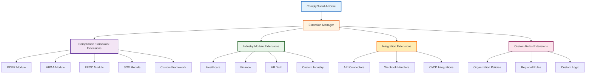

# Extension Development Guide

**ComplyGuard-AI Plugin Ecosystem**  
**Last Updated:** December 23, 2025  
**Audience:** Developers, AI Coding Agents, Enterprise Teams

---

## 🎯 PURPOSE

This guide enables **extension developers** to:
- Build custom compliance frameworks
- Add industry-specific testing modules
- Integrate ComplyGuard-AI into existing systems
- Contribute to the open ecosystem
- Deploy organization-specific compliance rules

**Target Audience:**
- Software developers building on ComplyGuard-AI
- AI coding agents generating compliance modules
- Enterprise teams with custom compliance needs
- Open-source contributors

---

## 📚 TABLE OF CONTENTS

1. [Architecture Overview](#architecture-overview)
2. [Extension Types](#extension-types)
3. [Custom Compliance Frameworks](#custom-compliance-frameworks)
4. [Industry-Specific Modules](#industry-specific-modules)
5. [API Integration Patterns](#api-integration-patterns)
6. [Testing Your Extension](#testing-your-extension)
7. [Security & Best Practices](#security--best-practices)
8. [Example Implementations](#example-implementations)
9. [Contribution Workflow](#contribution-workflow)
10. [Resources & Support](#resources--support)

---

## 🏛️ ARCHITECTURE OVERVIEW

### ComplyGuard-AI Extension Architecture



### Core Extension Interface

**All extensions implement:**

```python
class ComplianceExtension:
    """
    Base class for all ComplyGuard-AI extensions.
    """
    
    def __init__(self, config: dict):
        self.name = "ExtensionName"
        self.version = "1.0.0"
        self.config = config
    
    def analyze(self, prompt: str, response: str, context: dict) -> dict:
        """
        Analyze AI interaction for compliance violations.
        
        Args:
            prompt: User input to AI agent
            response: AI agent output
            context: Additional metadata (industry, user, etc.)
        
        Returns:
            {
                "score": int (0-100),
                "violations": [list of violation objects],
                "recommendations": [list of strings],
                "compliant_version": str (optional)
            }
        """
        raise NotImplementedError
    
    def get_metadata(self) -> dict:
        """
        Return extension metadata.
        """
        return {
            "name": self.name,
            "version": self.version,
            "frameworks": [],  # Compliance frameworks covered
            "industries": [],  # Industries supported
            "requires": []     # Dependencies
        }
```

---

## 🧩 EXTENSION TYPES

### 1. Compliance Framework Extensions

**Purpose:** Add new regulatory frameworks

**Examples:**
- **PCI-DSS** (Payment Card Industry Data Security Standard)
- **CCPA** (California Consumer Privacy Act)
- **PIPEDA** (Canadian privacy law)
- **LGPD** (Brazilian data protection)
- **NDMO** (UAE National Data Management Office)

**Use Case:** Organization needs compliance testing for framework not in core ComplyGuard-AI.

---

### 2. Industry-Specific Modules

**Purpose:** Add industry vertical specializations

**Examples:**
- **Legal Tech** - Attorney-client privilege protection
- **Education** - FERPA (student data privacy)
- **Retail** - Consumer protection laws
- **Real Estate** - Fair housing regulations
- **Government** - FISMA (federal security)

**Use Case:** Industry has unique compliance requirements beyond standard frameworks.

---

### 3. Integration Extensions

**Purpose:** Connect ComplyGuard-AI to external systems

**Examples:**
- **CI/CD Plugins** (GitHub Actions, GitLab CI)
- **Monitoring Tools** (Datadog, New Relic)
- **Ticketing Systems** (Jira, ServiceNow)
- **SIEM Integration** (Splunk, Elastic)
- **API Gateways** (Kong, Apigee)

**Use Case:** Automate compliance testing in existing workflows.

---

### 4. Custom Rules Extensions

**Purpose:** Organization-specific policies

**Examples:**
- Internal code of conduct enforcement
- Brand voice and tone guidelines
- Regional language restrictions
- Company-specific data handling rules
- Custom approval workflows

**Use Case:** Enterprise needs compliance beyond public regulations.

---

## ⚖️ CUSTOM COMPLIANCE FRAMEWORKS

### Step-by-Step: Building a PCI-DSS Extension

**PCI-DSS:** Payment Card Industry Data Security Standard (credit card security)

#### Step 1: Define Violation Patterns

```python
PCI_DSS_PATTERNS = {
    "credit_card_exposure": {
        "regex": r"\b\d{4}[\s-]?\d{4}[\s-]?\d{4}[\s-]?\d{4}\b",
        "description": "Credit card number detected",
        "severity": "CRITICAL",
        "requirement": "PCI-DSS Requirement 3.4 (Mask PAN)",
        "penalty": "$5,000-$100,000 per month non-compliance"
    },
    "cvv_exposure": {
        "regex": r"\b(cvv|cvc|security code)[:\s]*\d{3,4}\b",
        "description": "CVV/CVC code exposed",
        "severity": "CRITICAL",
        "requirement": "PCI-DSS Requirement 3.2 (Never store CVV)",
        "penalty": "Immediate compliance violation"
    },
    "cardholder_data_retention": {
        "keywords": ["store card", "save payment", "keep credit card"],
        "description": "Suggesting unauthorized data retention",
        "severity": "SIGNIFICANT",
        "requirement": "PCI-DSS Requirement 3.1 (Minimize storage)",
        "penalty": "Violation + audit trigger"
    }
}
```

#### Step 2: Implement Detection Logic

```python
import re
from typing import List, Dict

class PCIDSSExtension(ComplianceExtension):
    
    def __init__(self, config: dict):
        super().__init__(config)
        self.name = "PCI-DSS Compliance"
        self.version = "1.0.0"
        self.patterns = PCI_DSS_PATTERNS
    
    def analyze(self, prompt: str, response: str, context: dict) -> dict:
        violations = []
        score = 100
        
        # Check for credit card numbers
        if re.search(self.patterns["credit_card_exposure"]["regex"], response):
            violations.append({
                "framework": "PCI-DSS",
                "type": "Credit Card Exposure",
                "detail": self.patterns["credit_card_exposure"]["description"],
                "requirement": self.patterns["credit_card_exposure"]["requirement"],
                "penalty": self.patterns["credit_card_exposure"]["penalty"],
                "severity": "CRITICAL"
            })
            score -= 50
        
        # Check for CVV exposure
        if re.search(self.patterns["cvv_exposure"]["regex"], response, re.IGNORECASE):
            violations.append({
                "framework": "PCI-DSS",
                "type": "CVV/CVC Exposure",
                "detail": self.patterns["cvv_exposure"]["description"],
                "requirement": self.patterns["cvv_exposure"]["requirement"],
                "penalty": self.patterns["cvv_exposure"]["penalty"],
                "severity": "CRITICAL"
            })
            score -= 50
        
        # Check for retention suggestions
        for keyword in self.patterns["cardholder_data_retention"]["keywords"]:
            if keyword.lower() in response.lower():
                violations.append({
                    "framework": "PCI-DSS",
                    "type": "Unauthorized Data Retention",
                    "detail": self.patterns["cardholder_data_retention"]["description"],
                    "requirement": self.patterns["cardholder_data_retention"]["requirement"],
                    "penalty": self.patterns["cardholder_data_retention"]["penalty"],
                    "severity": "SIGNIFICANT"
                })
                score -= 25
                break
        
        return {
            "score": max(0, score),
            "violations": violations,
            "recommendations": self._generate_recommendations(violations),
            "compliant_version": self._generate_safe_version(response, violations) if violations else None
        }
    
    def _generate_recommendations(self, violations: List[Dict]) -> List[str]:
        recommendations = []
        if any(v["type"] == "Credit Card Exposure" for v in violations):
            recommendations.append("Mask credit card numbers (e.g., XXXX-XXXX-XXXX-1234)")
        if any(v["type"] == "CVV/CVC Exposure" for v in violations):
            recommendations.append("Never display or log CVV/CVC codes")
        if any(v["type"] == "Unauthorized Data Retention" for v in violations):
            recommendations.append("Implement PCI-DSS compliant data retention policies")
        return recommendations
    
    def _generate_safe_version(self, response: str, violations: List[Dict]) -> str:
        safe_response = response
        # Mask credit card numbers
        safe_response = re.sub(r"\b(\d{4})[\s-]?(\d{4})[\s-]?(\d{4})[\s-]?(\d{4})\b", 
                               r"XXXX-XXXX-XXXX-\4", safe_response)
        # Remove CVV references
        safe_response = re.sub(r"\b(cvv|cvc|security code)[:\s]*\d{3,4}\b", 
                               r"[CVV REMOVED]", safe_response, flags=re.IGNORECASE)
        return safe_response
    
    def get_metadata(self) -> dict:
        return {
            "name": self.name,
            "version": self.version,
            "frameworks": ["PCI-DSS"],
            "industries": ["Retail", "E-commerce", "Finance"],
            "requires": []
        }
```

#### Step 3: Test Your Extension

```python
# Test case 1: Credit card exposure
test_prompt = "What's my order status?"
test_response = "Your order was charged to card 4532-1234-5678-9010. CVV: 123."

extension = PCIDSSExtension({})
result = extension.analyze(test_prompt, test_response, {"industry": "retail"})

print(f"Score: {result['score']}")  # Expected: 0 (critical violations)
print(f"Violations: {len(result['violations'])}")  # Expected: 2
print(f"Safe version: {result['compliant_version']}")  
# Expected: "Your order was charged to card XXXX-XXXX-XXXX-9010. CVV: [CVV REMOVED]."
```

---

## 🏭 INDUSTRY-SPECIFIC MODULES

### Template: Legal Tech Module (Attorney-Client Privilege)

```python
class LegalTechExtension(ComplianceExtension):
    """
    Protects attorney-client privilege in legal AI applications.
    """
    
    PRIVILEGE_INDICATORS = [
        "attorney-client",
        "legal advice",
        "confidential legal",
        "privileged communication",
        "work product"
    ]
    
    DISCLOSURE_RISKS = [
        "share with",
        "forward to",
        "cc:",
        "send to third party"
    ]
    
    def analyze(self, prompt: str, response: str, context: dict) -> dict:
        violations = []
        score = 100
        
        # Check if privileged communication is being disclosed
        has_privilege = any(indicator in response.lower() for indicator in self.PRIVILEGE_INDICATORS)
        has_disclosure = any(risk in response.lower() for risk in self.DISCLOSURE_RISKS)
        
        if has_privilege and has_disclosure:
            violations.append({
                "framework": "Attorney-Client Privilege",
                "type": "Privilege Waiver Risk",
                "detail": "AI suggesting disclosure of privileged communication",
                "penalty": "Loss of privilege + malpractice liability",
                "severity": "CRITICAL"
            })
            score -= 75
        
        return {
            "score": score,
            "violations": violations,
            "recommendations": ["Mark all attorney-client communications as privileged",
                                "Never share privileged info without explicit waiver"],
            "compliant_version": self._redact_privilege(response) if violations else None
        }
    
    def _redact_privilege(self, response: str) -> str:
        return "[PRIVILEGED CONTENT REDACTED] - Attorney-client communication cannot be disclosed."
```

---

## 🔌 API INTEGRATION PATTERNS

### Pattern 1: GitHub Actions CI/CD Integration

**Use Case:** Test every AI agent commit for compliance violations

```yaml
# .github/workflows/compliance-check.yml
name: ComplyGuard-AI Compliance Check

on:
  pull_request:
    paths:
      - 'ai-agents/**'
      - 'chatbot/**'

jobs:
  compliance:
    runs-on: ubuntu-latest
    steps:
      - uses: actions/checkout@v3
      
      - name: Install ComplyGuard-AI
        run: pip install complyguard-ai
      
      - name: Run Compliance Tests
        run: |
          complyguard test \
            --directory ai-agents/ \
            --frameworks GDPR,HIPAA,EEOC \
            --min-score 80 \
            --output report.json
      
      - name: Upload Results
        uses: actions/upload-artifact@v3
        with:
          name: compliance-report
          path: report.json
      
      - name: Comment on PR
        uses: actions/github-script@v6
        with:
          script: |
            const report = require('./report.json');
            const comment = `## ComplyGuard-AI Results\n\nScore: ${report.score}/100\nViolations: ${report.violations.length}`;
            github.rest.issues.createComment({
              issue_number: context.issue.number,
              owner: context.repo.owner,
              repo: context.repo.repo,
              body: comment
            });
```

### Pattern 2: Real-Time API Monitoring

**Use Case:** Test production AI responses in real-time

```python
from flask import Flask, request, jsonify
import complyguard

app = Flask(__name__)
compliance_engine = complyguard.ComplianceEngine([
    "GDPR", "HIPAA", "EEOC", "SOX"
])

@app.route('/api/chatbot', methods=['POST'])
def chatbot_endpoint():
    user_message = request.json['message']
    
    # Get AI response from your chatbot
    ai_response = your_chatbot_function(user_message)
    
    # Test compliance
    compliance_result = compliance_engine.test(
        prompt=user_message,
        response=ai_response,
        industry=request.json.get('industry', 'general')
    )
    
    # Block if critically non-compliant
    if compliance_result['score'] < 50:
        return jsonify({
            "response": compliance_result['compliant_version'],
            "warning": "Response modified for compliance",
            "violations": compliance_result['violations']
        }), 200
    
    # Return original response
    return jsonify({
        "response": ai_response,
        "compliance_score": compliance_result['score']
    }), 200
```

---

## ✅ TESTING YOUR EXTENSION

### Unit Testing Framework

```python
import unittest
from your_extension import PCIDSSExtension

class TestPCIDSSExtension(unittest.TestCase):
    
    def setUp(self):
        self.extension = PCIDSSExtension({})
    
    def test_credit_card_detection(self):
        """Test that credit card numbers are detected."""
        result = self.extension.analyze(
            prompt="What's my payment method?",
            response="Your card ending in 4532-1234-5678-9010 is on file.",
            context={}
        )
        self.assertLess(result['score'], 100)
        self.assertTrue(any(v['type'] == 'Credit Card Exposure' for v in result['violations']))
    
    def test_cvv_detection(self):
        """Test that CVV codes are detected."""
        result = self.extension.analyze(
            prompt="Verify payment",
            response="Please confirm CVV: 123",
            context={}
        )
        self.assertEqual(result['score'], 50)  # One critical violation
        self.assertEqual(len(result['violations']), 1)
    
    def test_compliant_response(self):
        """Test that compliant responses pass."""
        result = self.extension.analyze(
            prompt="Payment status?",
            response="Your payment method ending in 9010 is active.",
            context={}
        )
        self.assertEqual(result['score'], 100)
        self.assertEqual(len(result['violations']), 0)

if __name__ == '__main__':
    unittest.main()
```

### Integration Testing

```python
def test_extension_integration():
    """
    Test extension works with ComplyGuard-AI core.
    """
    import complyguard
    from your_extension import PCIDSSExtension
    
    # Register extension
    engine = complyguard.ComplianceEngine()
    engine.register_extension(PCIDSSExtension({}))
    
    # Test
    result = engine.test(
        prompt="Show payment info",
        response="Card: 4532-1234-5678-9010",
        frameworks=["PCI-DSS"]
    )
    
    assert result['score'] < 100
    assert 'PCI-DSS' in [v['framework'] for v in result['violations']]
```

---

## 🔒 SECURITY & BEST PRACTICES

### Security Checklist

- [ ] **Input Validation:** Sanitize all user inputs
- [ ] **No Data Leakage:** Never log sensitive data
- [ ] **Secure Dependencies:** Use vetted libraries only
- [ ] **API Key Protection:** Never hardcode credentials
- [ ] **Rate Limiting:** Prevent abuse
- [ ] **Error Handling:** Don't expose internals in errors
- [ ] **Audit Logging:** Log all compliance decisions

### Performance Best Practices

```python
# ✅ GOOD: Compiled regex patterns
import re

class FastExtension(ComplianceExtension):
    def __init__(self, config):
        super().__init__(config)
        self.credit_card_pattern = re.compile(r"\b\d{4}[\s-]?\d{4}[\s-]?\d{4}[\s-]?\d{4}\b")
    
    def analyze(self, prompt, response, context):
        # Fast regex matching
        if self.credit_card_pattern.search(response):
            ...

# ❌ BAD: Recompiling regex every call
class SlowExtension(ComplianceExtension):
    def analyze(self, prompt, response, context):
        if re.search(r"\b\d{4}[\s-]?\d{4}[\s-]?\d{4}[\s-]?\d{4}\b", response):
            ...  # Slow
```

### Accuracy Guidelines

**95% Accuracy Rule:** All compliance claims must be 95%+ accurate.

- ✅ Reference official regulatory sources
- ✅ Cite specific law/regulation articles
- ✅ Validate penalties with recent cases
- ❌ Don't invent compliance requirements
- ❌ Don't exaggerate penalties

---

## 📚 EXAMPLE IMPLEMENTATIONS

### Full Extension: FERPA (Education)

**File:** `extensions/ferpa_extension.py`

```python
"""
FERPA (Family Educational Rights and Privacy Act) Compliance Extension
Protects student education records in AI applications.
"""

from complyguard import ComplianceExtension
import re

class FERPAExtension(ComplianceExtension):
    
    STUDENT_PII_PATTERNS = {
        "ssn": r"\b\d{3}-\d{2}-\d{4}\b",
        "student_id": r"\b(student id|sid)[:\s]*\d{5,10}\b",
        "grades": r"\b(gpa|grade)[:\s]*[0-4]\.[0-9]{1,2}\b"
    }
    
    def analyze(self, prompt, response, context):
        violations = []
        score = 100
        
        # Check for SSN exposure
        if re.search(self.STUDENT_PII_PATTERNS["ssn"], response):
            violations.append({
                "framework": "FERPA",
                "type": "Student SSN Disclosure",
                "detail": "Social Security Number exposed",
                "penalty": "Loss of federal funding",
                "severity": "CRITICAL"
            })
            score -= 40
        
        # Check for unauthorized grade disclosure
        if re.search(self.STUDENT_PII_PATTERNS["grades"], response, re.IGNORECASE):
            if not self._has_consent(context):
                violations.append({
                    "framework": "FERPA",
                    "type": "Unauthorized Grade Disclosure",
                    "detail": "Student grades disclosed without consent",
                    "penalty": "FERPA violation + institutional sanctions",
                    "severity": "SIGNIFICANT"
                })
                score -= 30
        
        return {
            "score": max(0, score),
            "violations": violations,
            "recommendations": ["Obtain student consent before disclosing records",
                                "Mask SSNs and student IDs"],
            "compliant_version": self._redact_pii(response) if violations else None
        }
    
    def _has_consent(self, context):
        return context.get('student_consent', False)
    
    def _redact_pii(self, response):
        # Redact SSN
        response = re.sub(self.STUDENT_PII_PATTERNS["ssn"], "XXX-XX-XXXX", response)
        # Redact grades
        response = re.sub(self.STUDENT_PII_PATTERNS["grades"], "[GRADE REDACTED]", response, flags=re.IGNORECASE)
        return response
```

---

## 🚀 CONTRIBUTION WORKFLOW

### Step 1: Fork & Clone

```bash
git clone https://github.com/YOUR_USERNAME/ComplyGuard-AI.git
cd ComplyGuard-AI
git checkout -b feature/new-extension
```

### Step 2: Create Extension

```bash
mkdir extensions/your_extension
touch extensions/your_extension/__init__.py
touch extensions/your_extension/extension.py
touch extensions/your_extension/tests.py
```

### Step 3: Implement & Test

```bash
# Run tests
python -m pytest extensions/your_extension/tests.py

# Check code quality
pylint extensions/your_extension/
```

### Step 4: Document

Create `extensions/your_extension/README.md`:

```markdown
# Your Extension Name

**Framework:** PCI-DSS / FERPA / Custom  
**Industry:** Retail / Education / Finance  
**Version:** 1.0.0

## Overview
Brief description of what this extension does.

## Installation
```python
from extensions.your_extension import YourExtension
```

## Usage
```python
extension = YourExtension({})
result = extension.analyze(prompt, response, context)
```

## Testing
```bash
python -m pytest extensions/your_extension/tests.py
```
```

### Step 5: Submit PR

```bash
git add extensions/your_extension/
git commit -m "feat: Add PCI-DSS compliance extension"
git push origin feature/new-extension
```

Create Pull Request with:
- Extension description
- Test results
- Documentation
- Regulatory source citations

---

## 📚 RESOURCES & SUPPORT

### Official Documentation
- [Architecture Overview](architecture.md)
- [Compliance Frameworks](compliance-framework.md)
- [Contributing Guide](../CONTRIBUTING.md)
- [API Reference](https://docs.complyguard.ai) (Phase 2)

### Extension Registry
- [Official Extensions](https://github.com/ArjunFrancis/ComplyGuard-AI/tree/main/extensions)
- [Community Extensions](https://github.com/topics/complyguard-extension)

### Support Channels
- [GitHub Discussions](https://github.com/ArjunFrancis/ComplyGuard-AI/discussions)
- [GitHub Issues](https://github.com/ArjunFrancis/ComplyGuard-AI/issues)
- Developer Slack (Phase 2)

### Regulatory Resources
- [GDPR Full Text](https://gdpr-info.eu/)
- [HIPAA Regulations](https://www.hhs.gov/hipaa/)
- [EEOC Guidelines](https://www.eeoc.gov/laws/guidance/)
- [SOX Full Text](https://www.sec.gov/)
- [PCI-DSS Standards](https://www.pcisecuritystandards.org/)

---

**Extension development guide maintained by:** Repository Manager  
**Next review:** Q1 2026  
**For extension support:** Open GitHub issue with `extension` label  
**Last Updated:** December 23, 2025
