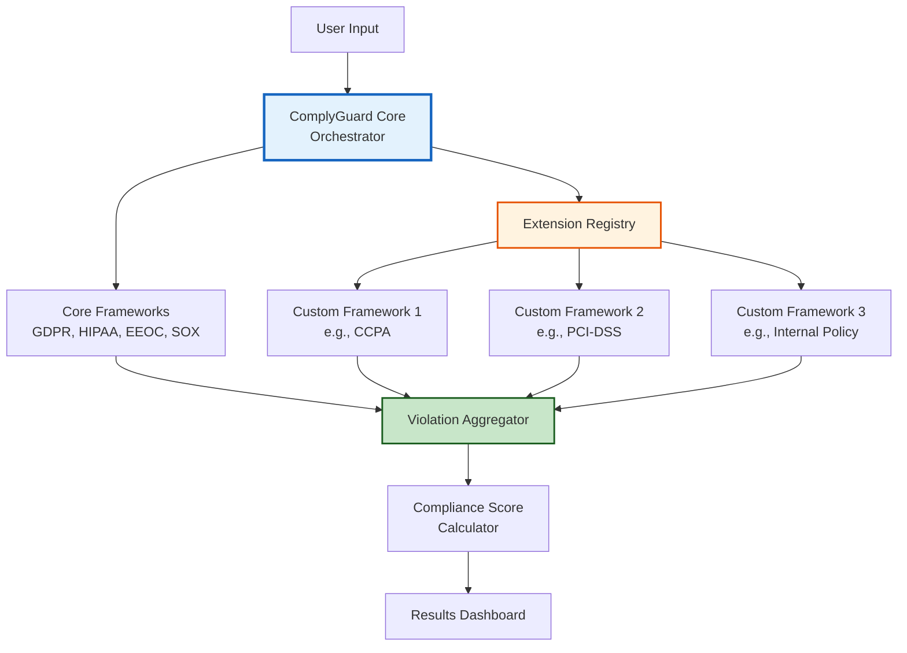

# Extension Development Guide

**ComplyGuard-AI Plugin & Custom Framework Development**  
**Last Updated:** December 23, 2025  
**Audience:** Developers, compliance engineers, coding agents

---

## 🎯 OVERVIEW

**Purpose:** This guide enables developers to **extend ComplyGuard-AI** with:
- Custom compliance frameworks (e.g., CCPA, PIPEDA, country-specific regulations)
- Industry-specific rules (e.g., PCI-DSS for payments, FERPA for education)
- Organization-specific policies (internal governance rules)
- Enhanced detection logic (custom regex, ML models)

**Who This Is For:**
- 🤖 AI coding agents building on ComplyGuard-AI
- 👩‍💻 Developers extending functionality
- 👨‍⚖️ Compliance engineers adding custom rules
- 🏢 Enterprises with unique compliance needs

---

## 🏛️ EXTENSION ARCHITECTURE

### Core vs. Extension Separation



**Key Principle:** Extensions are **modular plugins** that integrate seamlessly with core system.

---

## 🛠️ EXTENSION TYPES

### 1. **Compliance Framework Extensions**

**Purpose:** Add new regulatory frameworks (e.g., CCPA, LGPD, PIPEDA)

**Example Use Cases:**
- California businesses need CCPA compliance
- Brazilian companies need LGPD compliance
- Canadian entities need PIPEDA compliance

**Template:** `frameworks/ccpa_framework.py`

---

### 2. **Industry-Specific Extensions**

**Purpose:** Add industry regulations (e.g., PCI-DSS, FERPA, GLBA)

**Example Use Cases:**
- Payment processors need PCI-DSS compliance
- Educational institutions need FERPA compliance
- Financial advisors need GLBA compliance

**Template:** `industries/pci_dss_industry.py`

---

### 3. **Organization Policy Extensions**

**Purpose:** Enforce internal governance rules

**Example Use Cases:**
- Company-specific data handling policies
- Brand voice/tone requirements
- Custom approval workflows

**Template:** `policies/org_policy.py`

---

### 4. **Detection Enhancement Extensions**

**Purpose:** Improve violation detection (custom regex, ML models)

**Example Use Cases:**
- Detect company-specific sensitive data formats
- Industry jargon analysis
- Context-aware bias detection

**Template:** `detectors/custom_detector.py`

---

## 📝 STEP-BY-STEP: CREATE A CUSTOM FRAMEWORK

### Example: Adding CCPA (California Consumer Privacy Act)

---

#### **Step 1: Create Framework Class**

**File:** `extensions/frameworks/ccpa_framework.py`

```python
from complyguard.core.framework import BaseFramework
from complyguard.core.violation import Violation
from typing import List, Dict

class CCPAFramework(BaseFramework):
    """
    California Consumer Privacy Act (CCPA) compliance framework.
    
    Detects violations:
    - Personal information disclosure without consent
    - Failure to honor opt-out requests
    - Selling personal info without disclosure
    - Children's data (<16) collected without consent
    """
    
    def __init__(self):
        super().__init__(
            name="CCPA",
            full_name="California Consumer Privacy Act",
            jurisdiction="California, USA",
            max_penalty="$7,500 per intentional violation",
            official_url="https://oag.ca.gov/privacy/ccpa"
        )
        
    def analyze(self, prompt: str, response: str, context: Dict) -> List[Violation]:
        """
        Analyze AI response for CCPA violations.
        
        Args:
            prompt: User's input prompt
            response: AI's generated response
            context: Additional context (user location, data categories, etc.)
            
        Returns:
            List of detected violations
        """
        violations = []
        
        # Check 1: Personal Information Disclosure
        if self._detects_personal_info_disclosure(response):
            violations.append(Violation(
                framework="CCPA",
                category="Personal Information Disclosure",
                severity="HIGH",
                description="AI disclosed personal information without verifying consent",
                recommendation="Add consent verification before disclosing personal data",
                penalty_range="$2,500-$7,500 per violation",
                regulatory_citation="CCPA § 1798.100(a)",
                impact_score=-30
            ))
        
        # Check 2: Sale of Personal Information
        if self._detects_sale_without_disclosure(response):
            violations.append(Violation(
                framework="CCPA",
                category="Sale Without Disclosure",
                severity="CRITICAL",
                description="AI references selling personal info without required disclosure",
                recommendation="Provide 'Do Not Sell My Personal Information' link",
                penalty_range="$7,500 per intentional violation",
                regulatory_citation="CCPA § 1798.120",
                impact_score=-40
            ))
        
        # Check 3: Children's Data (Age < 16)
        if self._detects_child_data_without_consent(prompt, response, context):
            violations.append(Violation(
                framework="CCPA",
                category="Children's Data Collection",
                severity="CRITICAL",
                description="AI collected data from minor without parental consent",
                recommendation="Implement age verification and parental consent flow",
                penalty_range="$7,500 per intentional violation",
                regulatory_citation="CCPA § 1798.120(c)",
                impact_score=-45
            ))
        
        # Check 4: Opt-Out Request Denial
        if self._detects_opt_out_denial(response):
            violations.append(Violation(
                framework="CCPA",
                category="Opt-Out Denial",
                severity="HIGH",
                description="AI denies or obstructs consumer opt-out request",
                recommendation="Honor opt-out requests within 15 days per CCPA requirements",
                penalty_range="$2,500-$7,500 per violation",
                regulatory_citation="CCPA § 1798.135(a)(4)",
                impact_score=-35
            ))
        
        return violations
    
    def _detects_personal_info_disclosure(self, response: str) -> bool:
        """
        Check if AI discloses personal information without consent verification.
        """
        # California-specific personal info indicators
        ca_personal_info_patterns = [
            r'\bSSN\b.*\d{3}-\d{2}-\d{4}',  # Social Security Number
            r'\bCA\s+Driver.*License.*\d{8}',  # CA Driver's License
            r'\bCA\s+ID.*\d{8}',  # CA State ID
            r'\bbiometric\s+data\b',  # Biometric data
            r'\bgeolocation\s+data\b',  # Geolocation data
        ]
        
        import re
        for pattern in ca_personal_info_patterns:
            if re.search(pattern, response, re.IGNORECASE):
                return True
        return False
    
    def _detects_sale_without_disclosure(self, response: str) -> bool:
        """
        Check if AI mentions selling personal info without disclosure.
        """
        sale_keywords = ['sell your data', 'share with third parties', 'monetize your information']
        disclosure_keywords = ['Do Not Sell', 'opt-out', 'privacy choices']
        
        has_sale_mention = any(keyword in response.lower() for keyword in sale_keywords)
        has_disclosure = any(keyword in response.lower() for keyword in disclosure_keywords)
        
        return has_sale_mention and not has_disclosure
    
    def _detects_child_data_without_consent(self, prompt: str, response: str, context: Dict) -> bool:
        """
        Check if AI collects data from children (<16) without parental consent.
        """
        # Check if user is a minor
        user_age = context.get('user_age')
        if user_age and user_age < 16:
            # Check if parental consent was obtained
            parental_consent = context.get('parental_consent', False)
            if not parental_consent:
                # Check if AI is collecting personal data
                data_collection_keywords = ['your name', 'your email', 'your address', 'your phone']
                if any(keyword in response.lower() for keyword in data_collection_keywords):
                    return True
        return False
    
    def _detects_opt_out_denial(self, response: str) -> bool:
        """
        Check if AI denies consumer opt-out request.
        """
        opt_out_request_indicators = ['don\'t sell my', 'opt out', 'stop sharing']
        denial_indicators = ['cannot opt out', 'required to share', 'not available']
        
        has_opt_out_request = any(indicator in response.lower() for indicator in opt_out_request_indicators)
        has_denial = any(indicator in response.lower() for indicator in denial_indicators)
        
        return has_opt_out_request and has_denial

# Register the framework
from complyguard.core.registry import FrameworkRegistry
FrameworkRegistry.register(CCPAFramework())
```

---

#### **Step 2: Create Test Suite**

**File:** `tests/test_ccpa_framework.py`

```python
import pytest
from extensions.frameworks.ccpa_framework import CCPAFramework

def test_personal_info_disclosure():
    """Test detection of personal information disclosure."""
    framework = CCPAFramework()
    
    prompt = "What's my account status?"
    response = "Your SSN is 123-45-6789 and your CA Driver License is 12345678."
    context = {}
    
    violations = framework.analyze(prompt, response, context)
    
    assert len(violations) > 0
    assert any(v.category == "Personal Information Disclosure" for v in violations)
    assert violations[0].severity == "HIGH"

def test_sale_without_disclosure():
    """Test detection of selling personal info without disclosure."""
    framework = CCPAFramework()
    
    prompt = "How do you make money?"
    response = "We sell your data to third-party advertisers to monetize your information."
    context = {}
    
    violations = framework.analyze(prompt, response, context)
    
    assert len(violations) > 0
    assert any(v.category == "Sale Without Disclosure" for v in violations)
    assert violations[0].severity == "CRITICAL"

def test_child_data_collection():
    """Test detection of children's data collection without consent."""
    framework = CCPAFramework()
    
    prompt = "Sign up for account"
    response = "Please provide your name, email, and address to create your account."
    context = {'user_age': 14, 'parental_consent': False}
    
    violations = framework.analyze(prompt, response, context)
    
    assert len(violations) > 0
    assert any(v.category == "Children's Data Collection" for v in violations)
    assert violations[0].regulatory_citation == "CCPA § 1798.120(c)"

def test_opt_out_denial():
    """Test detection of opt-out request denial."""
    framework = CCPAFramework()
    
    prompt = "I want to opt out of data sharing"
    response = "Sorry, you cannot opt out. Data sharing is required to use our service."
    context = {}
    
    violations = framework.analyze(prompt, response, context)
    
    assert len(violations) > 0
    assert any(v.category == "Opt-Out Denial" for v in violations)
    assert violations[0].impact_score == -35

def test_compliant_response():
    """Test that compliant response triggers no violations."""
    framework = CCPAFramework()
    
    prompt = "What data do you collect?"
    response = "We collect only necessary data with your consent. You can opt out anytime via our 'Do Not Sell My Personal Information' link."
    context = {}
    
    violations = framework.analyze(prompt, response, context)
    
    assert len(violations) == 0  # No violations for compliant response
```

---

#### **Step 3: Register Extension**

**File:** `config/extensions.yaml`

```yaml
extensions:
  frameworks:
    - name: ccpa
      class: extensions.frameworks.ccpa_framework.CCPAFramework
      enabled: true
      jurisdictions:
        - California
        - USA
      priority: 5  # Higher priority = evaluated first
      
  industries:
    - name: pci_dss
      class: extensions.industries.pci_dss_industry.PCIDSSIndustry
      enabled: false  # Disabled by default, enable per customer
      
  policies:
    - name: acme_corp_policy
      class: extensions.policies.acme_corp.AcmeCorpPolicy
      enabled: false  # Organization-specific
```

---

#### **Step 4: Test Integration**

**Command-line test:**

```bash
# Test CCPA framework
python -m complyguard test \
  --framework ccpa \
  --prompt "What's my account info?" \
  --response "Your SSN is 123-45-6789" \
  --context '{"user_location": "California"}'

# Expected output:
# Compliance Score: 60/100
# Violations: 1
# - CCPA: Personal Information Disclosure (HIGH)
#   - Penalty: $2,500-$7,500
#   - Fix: Add consent verification before disclosing personal data
```

---

## 🧰 EXTENSION API REFERENCE

### BaseFramework Class

**Location:** `complyguard/core/framework.py`

```python
class BaseFramework:
    """
    Base class for all compliance frameworks.
    
    Custom frameworks must inherit from this class and implement analyze().
    """
    
    def __init__(self, name: str, full_name: str, jurisdiction: str, 
                 max_penalty: str, official_url: str):
        """Initialize framework metadata."""
        pass
    
    def analyze(self, prompt: str, response: str, context: Dict) -> List[Violation]:
        """
        MUST IMPLEMENT: Analyze AI response for violations.
        
        Args:
            prompt: User's input prompt
            response: AI's generated response
            context: Additional context dictionary
            
        Returns:
            List of Violation objects
        """
        raise NotImplementedError("Subclasses must implement analyze()")
    
    def generate_compliant_version(self, response: str, violations: List[Violation]) -> str:
        """
        OPTIONAL: Generate compliant alternative response.
        
        Default implementation uses Gemini 3 Pro.
        Override for custom remediation logic.
        """
        pass
```

---

### Violation Class

**Location:** `complyguard/core/violation.py`

```python
class Violation:
    """
    Represents a single compliance violation.
    """
    
    def __init__(self, 
                 framework: str,           # e.g., "CCPA"
                 category: str,            # e.g., "Personal Information Disclosure"
                 severity: str,            # "LOW", "MEDIUM", "HIGH", "CRITICAL"
                 description: str,         # Human-readable explanation
                 recommendation: str,      # How to fix
                 penalty_range: str,       # e.g., "$2,500-$7,500"
                 regulatory_citation: str, # e.g., "CCPA § 1798.100(a)"
                 impact_score: int):       # -10 to -50 (subtracted from 100)
        pass
```

---

### FrameworkRegistry

**Location:** `complyguard/core/registry.py`

```python
class FrameworkRegistry:
    """
    Global registry for all compliance frameworks.
    """
    
    @staticmethod
    def register(framework: BaseFramework):
        """Register a new compliance framework."""
        pass
    
    @staticmethod
    def get_framework(name: str) -> BaseFramework:
        """Retrieve framework by name."""
        pass
    
    @staticmethod
    def list_frameworks() -> List[str]:
        """List all registered frameworks."""
        pass
```

---

## ✅ BEST PRACTICES

### 1. **Accuracy First (95% Rule)**

- Validate all regulatory citations with official sources
- Test with 50+ real-world examples before deployment
- Document false positive rate (<5% target)

**Example:**
```python
# BAD: Vague penalty description
penalty_range="Large fines possible"

# GOOD: Specific penalty with source
penalty_range="$2,500-$7,500 per violation (CCPA § 1798.155)"
```

---

### 2. **Explicit Over Implicit**

- Clearly state what triggers a violation
- Avoid ambiguous detection logic
- Provide concrete examples in docstrings

**Example:**
```python
# BAD: Implicit logic
if "bad_thing" in response:
    return True

# GOOD: Explicit with explanation
if self._contains_ssn_pattern(response):
    # SSN disclosure without consent verification violates CCPA § 1798.100(a)
    return True
```

---

### 3. **Context-Aware Detection**

- Use `context` parameter for user-specific checks (age, location, consent status)
- Don't flag violations if user explicitly consented

**Example:**
```python
def analyze(self, prompt, response, context):
    # Check if user previously consented
    if context.get('ccpa_consent_given', False):
        return []  # No violations if consent exists
    
    # Otherwise, proceed with checks...
```

---

### 4. **Severity Calibration**

**Severity Levels:**
- **LOW:** Minor procedural issue (impact: -10)
- **MEDIUM:** Regulatory non-compliance but low risk (impact: -20)
- **HIGH:** Clear violation with penalties (impact: -30 to -35)
- **CRITICAL:** Severe violation with high penalties or criminal liability (impact: -40 to -50)

---

### 5. **Testing Coverage**

**Minimum Test Cases:**
- ✅ True positive (violation correctly detected)
- ✅ True negative (compliant response, no false alarm)
- ✅ Edge case (ambiguous scenario)
- ✅ Context-dependent (violation only in certain contexts)

---

## 🔒 SECURITY CONSIDERATIONS

### 1. **Avoid Regex Injection**

```python
# BAD: User input directly in regex
import re
pattern = user_input  # DANGEROUS!
re.search(pattern, response)

# GOOD: Sanitize or use predefined patterns only
ALLOWED_PATTERNS = ['ssn', 'email', 'phone']
if pattern_name in ALLOWED_PATTERNS:
    pattern = PATTERNS[pattern_name]
    re.search(pattern, response)
```

---

### 2. **Validate External Data**

```python
# BAD: Trust context without validation
user_age = context['user_age']  # Could be malicious

# GOOD: Validate and sanitize
user_age = context.get('user_age')
if user_age and isinstance(user_age, int) and 0 < user_age < 120:
    # Proceed with validated age
```

---

### 3. **Rate Limiting for ML Models**

If your extension uses external ML models, implement rate limiting:

```python
from functools import lru_cache
import time

class CustomDetector:
    def __init__(self):
        self.last_call = 0
        self.min_interval = 0.1  # 100ms between calls
    
    def detect(self, text):
        # Rate limiting
        elapsed = time.time() - self.last_call
        if elapsed < self.min_interval:
            time.sleep(self.min_interval - elapsed)
        
        result = self._call_ml_model(text)
        self.last_call = time.time()
        return result
```

---

## 📚 RELATED DOCUMENTS

- [docs/architecture.md](architecture.md) - Core system architecture
- [docs/compliance-framework.md](compliance-framework.md) - Existing framework details
- [docs/future-roadmap.md](future-roadmap.md) - Extension ecosystem roadmap
- [CONTRIBUTING.md](../CONTRIBUTING.md) - Contribution guidelines
- [README.md](../README.md) - Project overview

---

## 🐛 DEBUGGING TIPS

### Enable Verbose Logging

```python
import logging
logging.basicConfig(level=logging.DEBUG)

framework = CCPAFramework()
violations = framework.analyze(prompt, response, context)
# Logs detailed detection steps
```

---

### Test Individual Detectors

```python
# Isolate specific detection method
framework = CCPAFramework()
result = framework._detects_personal_info_disclosure("SSN: 123-45-6789")
assert result == True
```

---

### Compare with Core Frameworks

```python
# Benchmark against GDPR (similar to CCPA)
from complyguard.frameworks import GDPRFramework

gdpr = GDPRFramework()
ccpa = CCPAFramework()

gdpr_violations = gdpr.analyze(prompt, response, context)
ccpa_violations = ccpa.analyze(prompt, response, context)

print(f"GDPR: {len(gdpr_violations)}, CCPA: {len(ccpa_violations)}")
```

---

## ❓ FAQ

**Q: Can extensions modify core frameworks?**  
A: No. Extensions can only add new frameworks, not modify existing ones (GDPR, HIPAA, EEOC, SOX).

**Q: What's the performance impact of adding extensions?**  
A: Each extension adds ~50-100ms latency. Optimize regex and avoid external API calls in hot paths.

**Q: Can I sell my extension?**  
A: Yes, under MIT license terms. Attribution required.

**Q: How do I report bugs in core frameworks?**  
A: File GitHub issue with "[Core Framework]" tag.

---

**Extension development guide maintained by:** Repository Manager  
**Next review:** Q2 2026  
**Last Updated:** December 23, 2025
