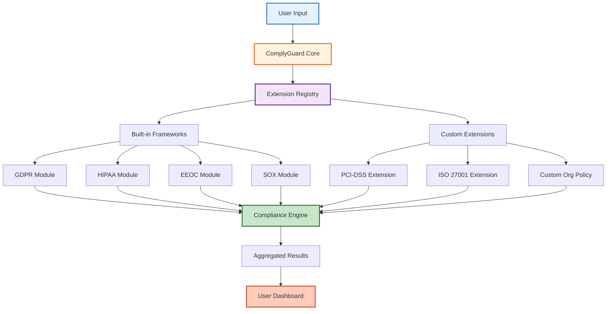

# Extension Development Guide

**ComplyGuard-AI Plugin Ecosystem**  
**Last Updated:** December 23, 2025  
**Version:** 1.0 (Phase 2 Preparation)

---

## 📚 OVERVIEW

**Purpose:** This guide enables developers to create custom compliance framework extensions for ComplyGuard-AI, including:
- Industry-specific regulations (PCI-DSS, ISO 27001, etc.)
- Regional frameworks (LGPD, PIPEDA, APPI, etc.)
- Custom organizational policies
- Sector-specific safety checks

**Extension Architecture:** ComplyGuard-AI Phase 2 uses a **modular plugin system** allowing third-party compliance framework additions without modifying core codebase.

---

## 🎯 WHO SHOULD USE THIS GUIDE?

### Target Audiences

**1. Compliance Engineers**
- Building custom regulatory frameworks
- Adapting existing frameworks to organizational needs
- Creating industry-specific compliance checks

**2. Software Developers**
- Integrating ComplyGuard-AI into existing platforms
- Building automation workflows
- Creating API-based compliance pipelines

**3. AI/ML Engineers**
- Developing bias detection algorithms
- Creating custom scoring models
- Training compliance-specific classifiers

**4. Open Source Contributors**
- Adding support for new regulations
- Improving detection accuracy
- Documenting compliance frameworks

---

## 🏭 EXTENSION ARCHITECTURE

### System Overview



---

## 🛠️ EXTENSION STRUCTURE

### File Organization

**Standard Extension Layout:**

```
extensions/
└── my-compliance-framework/
    ├── manifest.json           # Extension metadata
    ├── framework.py           # Core compliance logic
    ├── test_cases.json        # Sample test cases
    ├── prompts/               # Gemini prompt templates
    │   ├── detection.txt
    │   └── remediation.txt
    ├── tests/                 # Unit tests
    │   └── test_framework.py
    ├── docs/                  # Documentation
    │   ├── README.md
    │   └── examples.md
    └── LICENSE                # Extension license
```

---

## 📋 MANIFEST FILE (manifest.json)

### Required Fields

```json
{
  "name": "pci-dss",
  "version": "1.0.0",
  "display_name": "PCI-DSS Payment Card Security",
  "description": "Payment Card Industry Data Security Standard compliance testing",
  "author": "Your Name or Organization",
  "license": "MIT",
  "complyguard_version": ">=2.0.0",
  "framework_type": "industry",
  "categories": ["financial", "security", "payment"],
  "regions": ["global"],
  "entry_point": "framework.py",
  "dependencies": [],
  "settings": {
    "severity_threshold": 70,
    "enable_remediation": true
  },
  "violation_types": [
    {
      "code": "PCI_DSS_CARD_EXPOSURE",
      "name": "Credit Card Number Exposure",
      "severity": "critical",
      "penalty": "$5K-$100K per incident"
    },
    {
      "code": "PCI_DSS_CVV_STORAGE",
      "name": "CVV Code Storage Violation",
      "severity": "critical",
      "penalty": "Card processing suspension"
    }
  ]
}
```

### Field Descriptions

| Field | Required | Description |
|-------|----------|-------------|
| `name` | Yes | Unique identifier (lowercase, hyphens) |
| `version` | Yes | Semantic versioning (MAJOR.MINOR.PATCH) |
| `display_name` | Yes | Human-readable name |
| `description` | Yes | Brief framework purpose |
| `author` | Yes | Developer name/organization |
| `license` | Yes | SPDX license identifier |
| `complyguard_version` | Yes | Minimum ComplyGuard-AI version |
| `framework_type` | Yes | `regulatory`, `industry`, `organizational`, `safety` |
| `categories` | Yes | Tags for discovery |
| `regions` | Yes | Geographic applicability |
| `entry_point` | Yes | Main Python file |
| `violation_types` | Yes | List of detectable violations |

---

## 🐍 FRAMEWORK IMPLEMENTATION (framework.py)

### Core Structure

```python
from complyguard.core import ComplianceFramework, ViolationResult, RemediationSuggestion
from typing import List, Dict

class PCIDSSFramework(ComplianceFramework):
    """
    PCI-DSS Payment Card Industry Data Security Standard
    
    Detects credit card data exposure, storage violations, 
    and payment processing non-compliance.
    """
    
    def __init__(self, config: Dict = None):
        super().__init__(name="pci-dss", config=config)
        self.version = "4.0"  # PCI-DSS version
        self.severity_threshold = config.get("severity_threshold", 70)
    
    def detect_violations(self, user_prompt: str, ai_response: str, context: Dict) -> List[ViolationResult]:
        """
        Main detection logic.
        
        Args:
            user_prompt: User's input to AI agent
            ai_response: AI agent's response
            context: Additional metadata (industry, user_role, etc.)
        
        Returns:
            List of ViolationResult objects
        """
        violations = []
        
        # Detection 1: Credit card numbers in response
        if self._contains_credit_card(ai_response):
            violations.append(ViolationResult(
                framework="PCI-DSS",
                code="PCI_DSS_CARD_EXPOSURE",
                severity="critical",
                description="AI response contains unmasked credit card number",
                affected_text=self._extract_card_number(ai_response),
                regulatory_citation="PCI-DSS Requirement 3.3: Mask PAN when displayed",
                penalty="$5,000-$100,000 per incident + card processing suspension",
                score_impact=-40
            ))
        
        # Detection 2: CVV storage
        if self._mentions_cvv_storage(ai_response):
            violations.append(ViolationResult(
                framework="PCI-DSS",
                code="PCI_DSS_CVV_STORAGE",
                severity="critical",
                description="AI recommends storing CVV codes (prohibited)",
                affected_text=self._extract_cvv_mention(ai_response),
                regulatory_citation="PCI-DSS Requirement 3.2.2: Do not store CVV after authorization",
                penalty="Card processing suspension + forensic investigation",
                score_impact=-35
            ))
        
        # More detection logic...
        
        return violations
    
    def generate_remediation(self, violation: ViolationResult) -> RemediationSuggestion:
        """
        Generate compliant alternative response.
        
        Args:
            violation: ViolationResult object
        
        Returns:
            RemediationSuggestion with fixed response
        """
        if violation.code == "PCI_DSS_CARD_EXPOSURE":
            return RemediationSuggestion(
                original_text=violation.affected_text,
                compliant_text="Card ending in [last 4 digits] on file",
                explanation="Mask all but last 4 digits of card number per PCI-DSS 3.3",
                implementation_steps=[
                    "Replace full card number with masked version (****-****-****-1234)",
                    "Implement tokenization for card storage",
                    "Use PCI-compliant payment gateway"
                ]
            )
        
        # More remediation logic...
    
    def _contains_credit_card(self, text: str) -> bool:
        """Detect credit card numbers using Luhn algorithm."""
        import re
        # Luhn algorithm implementation
        card_pattern = r'\b(?:\d{4}[- ]?){3}\d{4}\b'
        matches = re.findall(card_pattern, text)
        return any(self._is_valid_card(match) for match in matches)
    
    def _is_valid_card(self, number: str) -> bool:
        """Validate using Luhn checksum."""
        # Implementation of Luhn algorithm
        pass
```

### Required Methods

| Method | Required | Purpose |
|--------|----------|----------|
| `__init__` | Yes | Initialize framework with config |
| `detect_violations` | Yes | Core violation detection logic |
| `generate_remediation` | Yes | Create compliant alternative |
| `calculate_score` | No | Custom scoring (defaults to weighted sum) |
| `validate_context` | No | Check if framework applies to context |

---

## 🧪 TESTING YOUR EXTENSION

### Unit Test Structure

```python
import pytest
from extensions.pci_dss.framework import PCIDSSFramework

class TestPCIDSSFramework:
    
    def setup_method(self):
        self.framework = PCIDSSFramework()
    
    def test_detects_credit_card_exposure(self):
        """Test: AI response with full credit card number"""
        user_prompt = "What's my card on file?"
        ai_response = "Your card is 4532-1234-5678-9010"
        
        violations = self.framework.detect_violations(user_prompt, ai_response, {})
        
        assert len(violations) > 0
        assert any(v.code == "PCI_DSS_CARD_EXPOSURE" for v in violations)
        assert violations[0].severity == "critical"
    
    def test_allows_masked_card_numbers(self):
        """Test: Properly masked card is compliant"""
        user_prompt = "What's my card on file?"
        ai_response = "Your card ending in 9010 is on file"
        
        violations = self.framework.detect_violations(user_prompt, ai_response, {})
        
        assert not any(v.code == "PCI_DSS_CARD_EXPOSURE" for v in violations)
    
    def test_remediation_masks_card_number(self):
        """Test: Remediation properly masks card"""
        violation = ViolationResult(
            framework="PCI-DSS",
            code="PCI_DSS_CARD_EXPOSURE",
            affected_text="4532-1234-5678-9010"
        )
        
        remediation = self.framework.generate_remediation(violation)
        
        assert "****" in remediation.compliant_text
        assert "9010" in remediation.compliant_text
```

### Test Coverage Requirements

**Minimum Coverage:** 80% code coverage

**Required Tests:**
- ✅ Positive detection (violations correctly identified)
- ✅ Negative detection (compliant responses pass)
- ✅ Edge cases (borderline violations)
- ✅ Remediation quality (suggestions are compliant)
- ✅ Performance (under 500ms per test)

---

## 📦 PACKAGING & DISTRIBUTION

### Installation Methods

**Method 1: ComplyGuard Extension Registry (Phase 3)**
```bash
complyguard install pci-dss
```

**Method 2: Direct Installation**
```bash
cd extensions/
git clone https://github.com/yourname/complyguard-pci-dss.git
complyguard register ./complyguard-pci-dss
```

**Method 3: Python Package**
```bash
pip install complyguard-extension-pci-dss
```

### Publishing Checklist

- [ ] `manifest.json` complete with all required fields
- [ ] Unit tests passing (80%+ coverage)
- [ ] Documentation (`README.md`, `examples.md`)
- [ ] License file included
- [ ] Version number follows semantic versioning
- [ ] No hardcoded API keys or secrets
- [ ] Tested against latest ComplyGuard-AI version

---

## 📚 EXAMPLE EXTENSIONS

### Example 1: PCI-DSS (Payment Card Security)

**Use Case:** Financial services, e-commerce payment processing

**Key Violations Detected:**
- Credit card number exposure
- CVV code storage
- Cardholder data encryption failures
- PCI scope boundary violations

**Repository:** `complyguard-extension-pci-dss` (to be published)

---

### Example 2: ISO 27001 (Information Security)

**Use Case:** Enterprise security management systems

**Key Violations Detected:**
- Unauthorized information disclosure
- Weak access control recommendations
- Data classification mishandling
- Security policy deviations

**Repository:** `complyguard-extension-iso27001` (to be published)

---

### Example 3: LGPD (Brazil Data Protection)

**Use Case:** Companies serving Brazilian customers

**Key Violations Detected:**
- Personal data processing without legal basis
- Cross-border data transfer violations
- Data subject rights denial
- ANPD reporting failures

**Repository:** `complyguard-extension-lgpd` (to be published)

---

## 🤝 CONTRIBUTION WORKFLOW

### Step 1: Proposal

**Before building, submit a proposal:**

1. Open GitHub Discussion: "New Extension: [Framework Name]"
2. Describe:
   - Regulatory framework being implemented
   - Target industries/regions
   - Key violation types
   - Expected use cases
3. Get community feedback

### Step 2: Development

**Follow standards:**
- Use template: `extensions/template/`
- Write tests first (TDD recommended)
- Document as you code
- Follow Python PEP 8 style guide

### Step 3: Submission

**Pull Request Process:**

1. Fork repository
2. Create branch: `extension/framework-name`
3. Implement extension
4. Run tests: `pytest extensions/framework-name/tests/`
5. Submit PR with:
   - Extension code
   - Tests (80%+ coverage)
   - Documentation
   - Example usage

### Step 4: Review

**Review Criteria:**
- ✅ Code quality (linting, style)
- ✅ Test coverage (80% minimum)
- ✅ Documentation completeness
- ✅ Regulatory accuracy (95% rule)
- ✅ Performance benchmarks

---

## ⚠️ COMPLIANCE ACCURACY STANDARDS

### 95% Accuracy Rule

**Critical Requirement:** All compliance claims must be **95% accurate** and **source-verified**.

**Verification Process:**
1. Cite official regulatory documents
2. Include regulatory citation in violation descriptions
3. Link to authoritative sources
4. Review by legal/compliance experts (if possible)

**Example - Good:**
```python
regulatory_citation="PCI-DSS Requirement 3.3: Mask PAN when displayed. Source: https://docs-prv.pcisecuritystandards.org/PCI%20DSS/Standard/PCI-DSS-v4_0.pdf"
```

**Example - Bad:**
```python
regulatory_citation="I think PCI-DSS says you should mask cards"
```

---

## 📊 PERFORMANCE GUIDELINES

### Speed Requirements

| Operation | Target Time | Maximum Time |
|-----------|-------------|-------------|
| Violation Detection | <200ms | 500ms |
| Remediation Generation | <500ms | 1000ms |
| Full Framework Test | <1s | 2s |

### Optimization Tips

**1. Regex Compilation:**
```python
import re

class MyFramework(ComplianceFramework):
    def __init__(self):
        super().__init__()
        # Compile regex once, not per-test
        self.card_pattern = re.compile(r'\b(?:\d{4}[- ]?){3}\d{4}\b')
```

**2. Lazy Loading:**
```python
def detect_violations(self, user_prompt, ai_response, context):
    # Only load heavy resources if needed
    if "credit card" in ai_response.lower():
        return self._check_card_violations(ai_response)
    return []
```

---

## 🔗 RELATED DOCUMENTS

- [docs/architecture.md](architecture.md) - Core system architecture
- [docs/compliance-framework.md](compliance-framework.md) - Existing frameworks
- [CONTRIBUTING.md](../CONTRIBUTING.md) - General contribution guidelines
- [docs/future-roadmap.md](future-roadmap.md) - Extension API timeline (Phase 2)

---

## 📧 SUPPORT & COMMUNITY

**Questions?**
- 💬 [GitHub Discussions](https://github.com/ArjunFrancis/ComplyGuard-AI/discussions) - Ask questions
- 🐛 [GitHub Issues](https://github.com/ArjunFrancis/ComplyGuard-AI/issues) - Report bugs
- 📧 Extension Developer Mailing List (Phase 3)

---

**Extension development guide maintained by:** Repository Manager  
**Next review:** Phase 2 launch (Q1 2026)  
**Last Updated:** December 23, 2025
