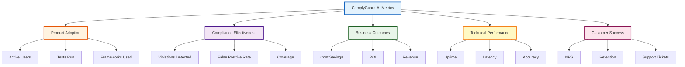

# Metrics Framework & KPI System

**ComplyGuard-AI Success Measurement**  
**Last Updated:** December 23, 2025  
**Purpose:** Define measurable outcomes and track product success  
**Audience:** Product managers, executives, investors

---

## 🎯 EXECUTIVE SUMMARY

This framework defines **how we measure ComplyGuard-AI's success** across five dimensions:

1. **Product Adoption:** Are customers using ComplyGuard-AI?
2. **Compliance Effectiveness:** Are we preventing violations?
3. **Business Outcomes:** Are we delivering ROI?
4. **Technical Performance:** Is the system reliable?
5. **Customer Success:** Are customers satisfied?

**North Star Metric:** **Violations Prevented** → Directly measures product value

---

## 📊 METRIC CATEGORIES

### Overview



---

## 1️⃣ PRODUCT ADOPTION METRICS

### Primary KPIs

| Metric | Definition | Target (Phase 1) | Target (Phase 2) | Measurement Frequency |
|--------|------------|------------------|------------------|-----------------------|
| **Active Users (MAU)** | Unique users running tests per month | 50 | 500 | Monthly |
| **Tests Run** | Total compliance tests executed | 1,000/month | 10,000/month | Daily |
| **Frameworks Used** | Avg frameworks tested per user | 2.5 | 3.5 | Weekly |
| **Industries Covered** | Unique industries using platform | 4 | 8 | Monthly |
| **API Calls (Phase 2)** | Total API requests | N/A | 50,000/month | Daily |

### Secondary KPIs

**Activation Rate:**
- % of signups who complete first test
- **Target:** 70% (Phase 1), 80% (Phase 2)
- **Current:** TBD (track from MVP launch)

**Feature Adoption:**
- % using multimodal testing (Phase 2)
- % using continuous monitoring (Phase 2)
- % using remediation suggestions

**Geographic Distribution:**
- UAE users: 30%
- US users: 40%
- EU users: 20%
- Other: 10%

---

## 2️⃣ COMPLIANCE EFFECTIVENESS METRICS

### Primary KPIs

| Metric | Definition | Target | Measurement |
|--------|------------|--------|-------------|
| **Violations Detected** (North Star) | Total compliance violations caught | 1,000/month (Phase 1) | Real-time dashboard |
| **Accuracy Rate** | % of violations correctly identified | 95%+ | Monthly validation |
| **False Positive Rate** | % of false alarms | <5% | User feedback + audit |
| **False Negative Rate** | % of missed violations | <3% | Expert review sample |
| **Severity Distribution** | Breakdown by MINOR/MODERATE/SIGNIFICANT/CRITICAL | 10/30/40/20 | Weekly analysis |

### Framework-Specific Metrics

**GDPR:**
- SSN/PII exposure detections: Target 200/month
- Cross-border transfer violations: Target 50/month
- Data subject rights violations: Target 100/month

**HIPAA:**
- PHI disclosure detections: Target 150/month
- Access control violations: Target 75/month
- Encryption failures: Target 25/month

**EEOC:**
- Age discrimination: Target 100/month
- Gender bias: Target 80/month
- Disability discrimination: Target 70/month

**SOX:**
- Financial data exposure: Target 50/month
- Fraud detection bias: Target 30/month
- Audit trail failures: Target 40/month

### Compliance Coverage

**Test Coverage Metrics:**
- % of AI agent outputs tested before deployment: Target 100%
- % of deployment pipelines with ComplyGuard integration: Target 80% (Phase 2)
- % of industries with dedicated testing profiles: Target 100% (8/8)

---

## 3️⃣ BUSINESS OUTCOMES METRICS

### Primary KPIs

| Metric | Definition | Target (Year 1) | Target (Year 2) | Target (Year 3) |
|--------|------------|-----------------|-----------------|------------------|
| **Revenue (ARR)** | Annual Recurring Revenue | $250K | $1M | $3M |
| **Customer Count** | Total paying customers | 20 | 80 | 150 |
| **ARPU** | Average Revenue Per User | $12K | $12.5K | $20K |
| **Cost Savings (Documented)** | Customer-reported savings | $2M | $10M | $30M |
| **ROI (Avg)** | Average customer ROI | 100x | 150x | 200x |

### Secondary KPIs

**Customer Acquisition:**
- CAC (Customer Acquisition Cost): Target <$5K
- Sales cycle length: Target <60 days
- Win rate: Target 30% (enterprise deals)

**Revenue Efficiency:**
- LTV:CAC ratio: Target 5:1
- Magic Number (Sales Efficiency): Target 1.0+
- Gross margin: Target 85%+

**Market Penetration:**
- UAE market share: Target 5% Year 1, 15% Year 2
- DIFC/ADGM penetration: Target 10% (50 companies)
- Hub71 adoption: Target 20% (40 startups)

---

## 4️⃣ TECHNICAL PERFORMANCE METRICS

### Primary KPIs

| Metric | Definition | Target | SLA |
|--------|------------|--------|-----|
| **Uptime** | Platform availability | 99.9% | 99.5% contractual |
| **Latency (P95)** | 95th percentile response time | <3 seconds | <5 seconds SLA |
| **Throughput** | Tests processed per second | 100 TPS | 50 TPS minimum |
| **Error Rate** | % of failed API calls | <0.1% | <1% SLA |
| **Gemini 3 Pro Success Rate** | % of successful LLM calls | 99.5% | 99% minimum |

### System Health Metrics

**Reliability:**
- Mean Time Between Failures (MTBF): Target 720 hours (30 days)
- Mean Time To Recovery (MTTR): Target <1 hour
- Incident rate: Target <2 P0/P1 incidents per month

**Scalability:**
- Concurrent users supported: Target 1,000 (Phase 2)
- Tests queued (max): Target <100
- Auto-scaling response time: Target <30 seconds

**Data Quality:**
- Model accuracy drift: Target <2% per quarter
- Training data freshness: Update monthly
- Regulatory update latency: Target <7 days from official publication

---

## 5️⃣ CUSTOMER SUCCESS METRICS

### Primary KPIs

| Metric | Definition | Target | Measurement |
|--------|------------|--------|-------------|
| **NPS (Net Promoter Score)** | Customer loyalty | 50+ | Quarterly survey |
| **Customer Retention** | % retained after 12 months | 90%+ | Monthly cohort analysis |
| **Churn Rate** | % customers canceling | <5% annual | Monthly tracking |
| **Product Satisfaction (CSAT)** | Post-test satisfaction | 4.5/5 | In-app survey |
| **Time to Value** | Days until first violation detected | <1 day | Onboarding analytics |

### Secondary KPIs

**Support Metrics:**
- Support ticket volume: Target <50/month (20 customers)
- First response time: Target <4 hours
- Resolution time: Target <24 hours
- Self-service resolution rate: Target 60%

**Engagement Metrics:**
- Weekly Active Users (WAU): Target 70% of MAU
- Daily Active Users (DAU): Target 30% of MAU
- Session duration: Target 15+ minutes
- Tests per session: Target 5+

**Advocacy Metrics:**
- Customer referrals: Target 20% of new customers
- Case studies published: Target 1 per quarter
- Testimonials collected: Target 10 per quarter

---

## 🎯 OKRS (OBJECTIVES & KEY RESULTS)

### Q1 2026 OKRs

**Objective 1: Validate Product-Market Fit**

**Key Results:**
- KR1: Achieve 50 Monthly Active Users (MAU)
- KR2: Reach 1,000 tests run per month
- KR3: Maintain 95%+ accuracy rate
- KR4: Achieve 70+ NPS score

**Objective 2: Establish UAE Market Presence**

**Key Results:**
- KR1: Onboard 5 Hub71 startups (pilot program)
- KR2: Sign 2 DIFC/ADGM enterprise customers
- KR3: Launch UAE framework support (NDMO, DIFC, ADGM)
- KR4: Generate $50K ARR from UAE market

**Objective 3: Prove Compliance Effectiveness**

**Key Results:**
- KR1: Detect 1,000+ violations per month
- KR2: Document $2M+ in customer cost savings
- KR3: Achieve <5% false positive rate
- KR4: Publish 2 case studies with ROI data

---

### Q2 2026 OKRs

**Objective 1: Scale Product Adoption**

**Key Results:**
- KR1: Grow to 200 MAU (4x growth)
- KR2: Process 10,000 tests per month
- KR3: Launch API (Phase 2) with 100+ API customers
- KR4: Expand to 8 industries

**Objective 2: Drive Revenue Growth**

**Key Results:**
- KR1: Achieve $250K ARR
- KR2: Sign 20 paying customers
- KR3: Maintain <$5K CAC
- KR4: Achieve 5:1 LTV:CAC ratio

**Objective 3: Enhance Platform Capabilities**

**Key Results:**
- KR1: Launch multimodal testing (vision, audio)
- KR2: Add continuous monitoring feature
- KR3: Achieve 99.9% uptime
- KR4: Reduce P95 latency to <2 seconds

---

## 📈 DASHBOARD DESIGN

### Executive Dashboard (Weekly Review)

**Top-Line Metrics:**
```
┌──────────────────────────────────────────────┐
│ COMPLYGUARD-AI METRICS (WEEK OF DEC 23, 2025) │
├──────────────────────────────────────────────┤
│ 🎯 North Star: Violations Prevented     1,243 ↑  │
│ 👥 Monthly Active Users (MAU)             52 ↑  │
│ 📊 Tests Run (MTD)                      1,089 ↑  │
│ 💰 ARR                                 $62K ↑  │
│ 🎯 Accuracy Rate                      96.2% ✓  │
│ ⭐ NPS Score                              72 ↑  │
└──────────────────────────────────────────────┘
```

**Trend Graphs:**
- MAU growth (weekly)
- Tests run trend (daily)
- Revenue trajectory (monthly)
- Compliance coverage by framework

---

### Product Dashboard (Daily Review)

**Usage Metrics:**
- Daily active users (DAU)
- Tests per user per day
- Framework usage distribution
- Industry breakdown

**Engagement Metrics:**
- Session duration
- Feature adoption rates
- Remediation acceptance rate
- API call volume (Phase 2)

---

### Compliance Dashboard (Real-Time)

**Violation Tracking:**
- Violations detected today
- Severity distribution
- Framework breakdown
- Top violation categories

**Quality Metrics:**
- Accuracy rate (rolling 7-day)
- False positive rate
- User-reported issues
- Model drift indicators

---

## 📊 MEASUREMENT METHODOLOGY

### Data Collection

**Instrumentation:**
- Google AI Studio analytics (Phase 1)
- Custom event tracking (Phase 2)
- API telemetry (Phase 2)
- User surveys (quarterly)

**Data Sources:**
- Application logs
- Database analytics
- User feedback forms
- Support ticket system
- Financial reports

### Reporting Cadence

| Metric Type | Review Frequency | Owner | Distribution |
|-------------|------------------|-------|---------------|
| **Executive Metrics** | Weekly | CEO/Founder | Leadership team |
| **Product Metrics** | Daily | Product Manager | Product/Eng teams |
| **Compliance Metrics** | Real-time | Compliance Lead | Operations team |
| **Financial Metrics** | Monthly | CFO | Board, investors |
| **Customer Success** | Weekly | CS Lead | CS team |

---

## 🔗 RELATED DOCUMENTS

- [docs/future-roadmap.md](future-roadmap.md) - Feature roadmap aligned to metrics
- [docs/enterprise-value.md](enterprise-value.md) - ROI measurement methodology
- [docs/competitive-analysis.md](competitive-analysis.md) - Market share targets
- [docs/kaggle-timeline.md](kaggle-timeline.md) - Competition success metrics

---

## 📝 METRIC DEFINITIONS GLOSSARY

**MAU (Monthly Active Users):** Unique users who run at least 1 test in a calendar month

**ARR (Annual Recurring Revenue):** Total annual contract value of active subscriptions

**ARPU (Average Revenue Per User):** ARR ÷ Total paying customers

**NPS (Net Promoter Score):** % Promoters (9-10) - % Detractors (0-6)

**Churn Rate:** (Customers lost ÷ Customers at start) × 100

**CAC (Customer Acquisition Cost):** Total sales & marketing spend ÷ New customers acquired

**LTV (Lifetime Value):** ARPU × Average customer lifetime (years)

**False Positive Rate:** Incorrect violation alerts ÷ Total alerts

**False Negative Rate:** Missed violations ÷ Total actual violations (from audit sample)

---

**Metrics framework maintained by:** Product Management  
**Dashboard updates:** Real-time (automated)  
**Next framework review:** Q2 2026  
**Last Updated:** December 23, 2025
