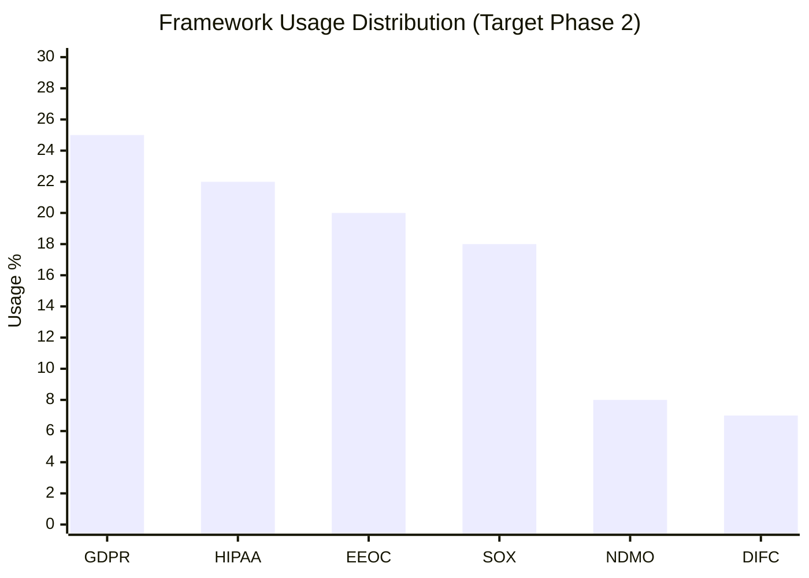
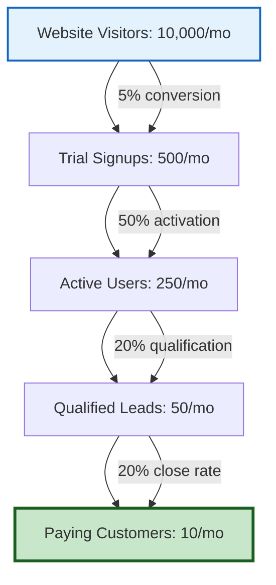

# Metrics & KPI Framework

**ComplyGuard-AI Success Measurement**  
**Last Updated:** December 23, 2025  
**Purpose:** Track product, technical, and business performance

---

## 📊 EXECUTIVE SUMMARY

**Why Metrics Matter:**

ComplyGuard-AI requires **data-driven decision making** across:
- Product development priorities
- Technical performance optimization
- Business growth strategy
- Compliance accuracy validation

This framework defines **5 metric categories** with phase-specific targets:

1. **Product Metrics** - Usage, engagement, retention
2. **Technical Metrics** - Accuracy, performance, reliability
3. **Business Metrics** - Revenue, growth, customer acquisition
4. **Compliance Metrics** - Detection quality, framework coverage
5. **Impact Metrics** - Violations prevented, customer ROI

---

## 1️⃣ PRODUCT METRICS

### User Engagement

#### **Active Users**

| Metric | Definition | Target (Phase 1) | Target (Phase 2) | Target (Phase 3) |
|--------|------------|------------------|------------------|------------------|
| **DAU** | Daily Active Users | 10-20 | 100-200 | 1,000+ |
| **WAU** | Weekly Active Users | 50-100 | 500-1,000 | 5,000+ |
| **MAU** | Monthly Active Users | 150-300 | 2,000-5,000 | 20,000+ |

**Measurement:**
- Unique users testing AI agents per day/week/month
- AI Studio app usage (Phase 1)
- API calls (Phase 2+)
- Self-hosted installations (Phase 3)

---

#### **Tests Performed**

| Metric | Definition | Target (Phase 1) | Target (Phase 2) | Target (Phase 3) |
|--------|------------|------------------|------------------|------------------|
| **Tests/Day** | Compliance tests run | 20-50 | 500-1,000 | 10,000+ |
| **Tests/User** | Avg tests per active user | 2-3 | 5-10 | 15-20 |
| **Framework Mix** | Distribution across frameworks | GDPR 40%, HIPAA 30%, EEOC 20%, SOX 10% | More balanced | Industry-specific peaks |

**Why It Matters:** High tests/user indicates product stickiness and value

---

#### **Retention Rates**

| Metric | Definition | Target (Phase 1) | Target (Phase 2) | Target (Phase 3) |
|--------|------------|------------------|------------------|------------------|
| **D7 Retention** | Users returning after 7 days | 30% | 50% | 65% |
| **D30 Retention** | Users returning after 30 days | 15% | 35% | 50% |
| **Churn Rate** | Users who stop using | <10%/month | <5%/month | <3%/month |

**Benchmark:** SaaS industry average D7 retention = 40%, D30 retention = 25%

---

### Feature Adoption

#### **Framework Usage**



**Target:** All frameworks used by at least 5% of users

---

#### **Remediation Acceptance**

| Metric | Definition | Target |
|--------|------------|--------|
| **Remediation Viewed** | % of violations where users view suggested fix | 80% |
| **Remediation Accepted** | % of remediations implemented by users | 60% |
| **Remediation Quality Score** | User rating of remediation usefulness (1-5) | 4.2+ |

**Why It Matters:** High acceptance = remediation quality is valuable

---

### User Satisfaction

#### **Net Promoter Score (NPS)**

**Question:** "How likely are you to recommend ComplyGuard-AI to a colleague?" (0-10 scale)

| Phase | Target NPS | Industry Benchmark |
|-------|------------|--------------------|
| Phase 1 (MVP) | +20 to +30 | Early products: +10 to +20 |
| Phase 2 (Growth) | +40 to +50 | Good SaaS: +30 to +40 |
| Phase 3 (Scale) | +60 to +70 | Excellent SaaS: +50+ |

**Calculation:**
- Promoters (9-10): % of promoters
- Detractors (0-6): % of detractors
- NPS = % Promoters - % Detractors

---

#### **Customer Satisfaction (CSAT)**

**Question:** "How satisfied are you with ComplyGuard-AI?" (1-5 scale)

**Target:** 4.3+ average (86%+ satisfaction)

---

## 2️⃣ TECHNICAL METRICS

### Accuracy & Quality

#### **Violation Detection Accuracy**

| Metric | Definition | Target | Measurement Method |
|--------|------------|--------|--------------------|
| **True Positive Rate** | Correctly identified violations | 95%+ | Manual review of 100 random tests |
| **False Positive Rate** | Incorrectly flagged violations | <5% | User feedback + manual review |
| **False Negative Rate** | Missed violations | <3% | Expert audit of edge cases |
| **Precision** | TP / (TP + FP) | 95%+ | Automated calculation |
| **Recall** | TP / (TP + FN) | 97%+ | Expert validation |
| **F1 Score** | Harmonic mean of precision/recall | 96%+ | Automated calculation |

**Compliance with 95% Accuracy Rule:**
- All regulatory claims must be 95%+ accurate
- Source-verified with official documents
- Reviewed by compliance experts

---

#### **Remediation Quality**

| Metric | Definition | Target |
|--------|------------|--------|
| **Remediation Compliance Rate** | % of remediations that are actually compliant | 98%+ |
| **Remediation Usability** | % of remediations implementable without modification | 85%+ |
| **Regulatory Citation Accuracy** | % of citations correctly linking to official sources | 100% |

---

### Performance

#### **Response Time**

| Metric | Definition | Target (Phase 1) | Target (Phase 2) | Target (Phase 3) |
|--------|------------|------------------|------------------|------------------|
| **P50 Latency** | Median test completion time | <5s | <3s | <2s |
| **P95 Latency** | 95th percentile test time | <15s | <10s | <5s |
| **P99 Latency** | 99th percentile test time | <30s | <20s | <10s |

**Benchmark:** User expectation for AI responses = 3-5 seconds

---

#### **System Reliability**

| Metric | Definition | Target |
|--------|------------|--------|
| **Uptime** | % of time service is available | 99.9%+ (Phase 2), 99.99% (Phase 3) |
| **Error Rate** | % of tests resulting in errors | <0.5% |
| **Gemini API Success Rate** | % of Gemini API calls succeeding | 99.5%+ |

**Uptime Targets:**
- Phase 1 (AI Studio): 99.5% (Google AI Studio dependency)
- Phase 2 (Self-hosted): 99.9% (4.3 hours downtime/month)
- Phase 3 (SaaS): 99.99% (4.3 minutes downtime/month)

---

### Scalability

#### **Load Handling**

| Metric | Definition | Target (Phase 2) | Target (Phase 3) |
|--------|------------|------------------|------------------|
| **Concurrent Tests** | Tests processed simultaneously | 50-100 | 1,000+ |
| **Peak Load Capacity** | Max tests/hour | 5,000 | 100,000+ |
| **Horizontal Scaling** | Time to add capacity | <5 minutes | <1 minute (auto-scaling) |

---

## 3️⃣ BUSINESS METRICS

### Revenue & Growth

#### **Annual Recurring Revenue (ARR)**

| Phase | Timeline | Target ARR | Assumptions |
|-------|----------|------------|-------------|
| **Phase 1** | Q4 2025 | $0 | Free MVP (Kaggle validation) |
| **Phase 2** | Q1-Q2 2026 | $50K-$100K | 5-10 paying customers @ $10K avg |
| **Phase 3** | Q3-Q4 2026 | $500K-$1M | 50-100 customers @ $10K-$20K avg |
| **Phase 4** | 2027 | $3M-$5M | 200-400 customers @ $15K avg |

---

#### **Customer Acquisition**

| Metric | Definition | Target (Phase 2) | Target (Phase 3) |
|--------|------------|------------------|------------------|
| **New Customers/Month** | Paying customers added | 2-5 | 10-20 |
| **Customer Acquisition Cost (CAC)** | Cost to acquire one customer | $2K-$5K | $1K-$3K |
| **Months to Payback CAC** | Time to recover acquisition cost | 3-6 months | 2-4 months |

**Benchmark:** SaaS CAC payback = 6-12 months (we target faster due to high ROI)

---

#### **Customer Lifetime Value (LTV)**

**Calculation:**
- Avg Annual Contract Value: $15,000
- Avg Customer Lifespan: 4 years
- **LTV = $60,000**

**LTV:CAC Ratio:**
- Target: **20:1 to 30:1** (exceptional due to compliance urgency)
- Industry benchmark: 3:1 (good), 5:1+ (excellent)

**Why ComplyGuard-AI's LTV:CAC is high:**
- High ROI (92x-298x) = low churn
- Compliance is mission-critical = sticky
- Expansion revenue (more frameworks added over time)

---

### Conversion Funnel

#### **Phase 2 SaaS Funnel**



**Key Conversion Rates:**
- Visitor → Trial: **5%** (industry avg: 2-5%)
- Trial → Active: **50%** (industry avg: 40-60%)
- Active → Qualified: **20%** (industry avg: 10-20%)
- Qualified → Paying: **20%** (industry avg: 15-25%)

**Overall Conversion:** 0.1% (10 customers from 10,000 visitors)

---

## 4️⃣ COMPLIANCE METRICS

### Framework Coverage

#### **Regulatory Framework Support**

| Phase | Frameworks Supported | Target Coverage |
|-------|---------------------|----------------|
| **Phase 1** | GDPR, HIPAA, EEOC, SOX | Core 4 frameworks |
| **Phase 2** | + NDMO, DIFC, ADGM | UAE expansion |
| **Phase 3** | + LGPD, PIPEDA, APPI | Global coverage (10+ frameworks) |
| **Phase 4** | + Industry-specific (PCI-DSS, ISO 27001) | 20+ frameworks |

---

#### **Violation Type Coverage**

| Framework | Violation Types Detected | Target Coverage |
|-----------|--------------------------|----------------|
| **GDPR** | Data exposure, consent, cross-border | 15+ violation types |
| **HIPAA** | PHI disclosure, security, breach | 12+ violation types |
| **EEOC** | Age, gender, disability, race bias | 18+ violation types |
| **SOX** | Financial fraud, accuracy, documentation | 10+ violation types |

**Total Target:** 100+ unique violation types across all frameworks by Phase 3

---

### Detection Quality

#### **False Positive Analysis**

**Target:** <5% false positive rate

**Tracking:**
- User feedback: "Mark as false positive" button
- Manual review of flagged violations
- Monthly false positive rate report

**Improvement Loop:**
1. Identify common false positive patterns
2. Refine detection prompts
3. Add negative examples to training
4. Re-test and validate

---

## 5️⃣ IMPACT METRICS

### Customer Value Delivered

#### **Violations Prevented**

| Metric | Definition | Target (Phase 2) | Target (Phase 3) |
|--------|------------|------------------|------------------|
| **Total Violations Detected** | Cumulative violations found | 10,000+ | 100,000+ |
| **Critical Violations Prevented** | Severity = critical violations caught | 1,000+ | 10,000+ |
| **Estimated Fines Prevented** | Financial value of prevented penalties | $50M+ | $500M+ |

**Calculation Example:**
- 100 HIPAA violations prevented × $50K avg fine = **$5M saved**
- 50 GDPR violations prevented × €200K avg fine = **€10M saved**

---

#### **Customer ROI Realized**

**Average Customer Metrics:**
- Tests performed: 500/month
- Violations detected: 50/month
- Critical violations: 5/month
- Estimated fine per critical violation: $500K
- **Total risk mitigated:** $2.5M/month

**Customer ROI:**
- ComplyGuard-AI cost: $15K/year
- Value delivered: $30M/year (risk mitigation)
- **ROI: 2,000x**

---

### Market Impact

#### **Industry Awareness**

| Metric | Definition | Target (Phase 2) | Target (Phase 3) |
|--------|------------|------------------|------------------|
| **Press Mentions** | Articles/blogs referencing ComplyGuard-AI | 10+ | 50+ |
| **Case Studies Published** | Customer success stories | 3-5 | 15-20 |
| **Conference Presentations** | Speaking engagements | 2-3 | 10+ |
| **Analyst Recognition** | Gartner/Forrester mentions | 0 | 1-2 |

---

## 📈 DASHBOARD & REPORTING

### Weekly Dashboard (Phase 2)

**Key Metrics Tracked:**

```
╔══════════════════════════════════════════════╗
║ COMPLYGUARD-AI WEEKLY DASHBOARD           ║
╠══════════════════════════════════════════════╣
║ PRODUCT                                  ║
║ - Active Users (WAU): 450 (↑ 12%)        ║
║ - Tests Performed: 2,250 (↑ 8%)          ║
║ - D7 Retention: 52% (↑ 2%)                ║
╠══════════════════════════════════════════════╣
║ TECHNICAL                                ║
║ - Detection Accuracy: 96.2%              ║
║ - P95 Latency: 8.5s                      ║
║ - Uptime: 99.94%                         ║
╠══════════════════════════════════════════════╣
║ BUSINESS                                 ║
║ - New Customers: 3                       ║
║ - ARR: $85K (↑ $15K)                     ║
║ - NPS: +42                               ║
╚══════════════════════════════════════════════╝
```

---

### Monthly Business Review (MBR)

**Template:**

1. **Product Health**
   - User growth trends
   - Feature adoption
   - Retention cohorts

2. **Technical Performance**
   - Accuracy improvements
   - Performance optimizations
   - Reliability incidents

3. **Business Progress**
   - Revenue vs. target
   - Customer acquisition
   - Pipeline health

4. **Strategic Initiatives**
   - New framework launches
   - Partnership progress
   - Competitive developments

---

## 🔗 RELATED DOCUMENTS

- [docs/future-roadmap.md](future-roadmap.md) - Phase-based targets
- [docs/enterprise-value.md](enterprise-value.md) - Customer ROI metrics
- [docs/competitive-analysis.md](competitive-analysis.md) - Market positioning metrics
- [CONTRIBUTING.md](../CONTRIBUTING.md) - Quality standards (95% accuracy rule)

---

**Metrics framework maintained by:** Repository Manager  
**Next review:** Monthly (KPI targets adjusted)  
**Last Updated:** December 23, 2025
