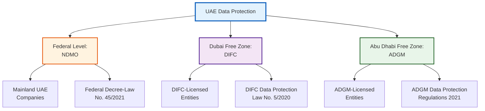

# UAE Regulatory Framework for AI Compliance

**ComplyGuard-AI Regional Compliance Strategy**  
**Last Updated:** December 23, 2025  
**Focus:** NDMO, DIFC, ADGM - United Arab Emirates

---

## 🎯 EXECUTIVE SUMMARY

The United Arab Emirates has established a **multi-jurisdictional data protection framework** with three key regulatory bodies:

1. **NDMO (National Data Management Office)** - Federal UAE-wide regulations
2. **DIFC (Dubai International Financial Centre)** - Dubai free zone regulations
3. **ADGM (Abu Dhabi Global Market)** - Abu Dhabi free zone regulations

**Strategic Importance for ComplyGuard-AI:**
- UAE is positioning as **regional AI hub** (Hub71, Dubai Future Foundation)
- Strong regulatory enforcement beginning (€1M+ fines possible)
- Enterprise AI adoption accelerating (government mandate: 50% AI integration by 2031)
- Regional expansion gateway (GCC, MENA markets)

**Phase 2 Roadmap:** Add UAE compliance testing alongside GDPR, HIPAA, EEOC, SOX (Q1-Q2 2026)

---

## 🇦🇪 UAE DATA PROTECTION LANDSCAPE

### Three-Tier Regulatory Structure



**Key Insight:** Companies operating in UAE must comply with **multiple frameworks** depending on jurisdiction. ComplyGuard-AI addresses this complexity.

---

## 1️⃣ NDMO - NATIONAL DATA MANAGEMENT OFFICE

### Overview

**Established:** 2021  
**Jurisdiction:** Federal UAE (mainland)  
**Governing Law:** Federal Decree-Law No. 45/2021 on Personal Data Protection  
**Enforcement:** Began January 2023  
**Penalties:** Up to AED 10M (~$2.7M USD) or 2-5 years imprisonment

### Key Principles

#### 1. **Lawfulness, Fairness, and Transparency**
- AI systems must process data with clear legal basis
- **ComplyGuard-AI Testing:** Detects opaque AI decision-making
- **Violation Example:** AI hiring tool that doesn't explain rejection reasons

#### 2. **Purpose Limitation**
- Data collected for specific purposes only
- **ComplyGuard-AI Testing:** Flags when AI repurposes data (e.g., marketing data used for credit scoring)
- **Violation Example:** Customer support chatbot sharing data with sales team

#### 3. **Data Minimization**
- Collect only necessary data
- **ComplyGuard-AI Testing:** Identifies excessive data collection by AI agents
- **Violation Example:** AI asking for passport number when email suffices

#### 4. **Accuracy**
- Data must be accurate and up-to-date
- **ComplyGuard-AI Testing:** Detects AI outputs based on stale/incorrect data
- **Violation Example:** AI denying service based on outdated credit score

#### 5. **Storage Limitation**
- Data retained only as long as necessary
- **ComplyGuard-AI Testing:** Flags AI systems referencing old data inappropriately
- **Violation Example:** AI mentioning 10-year-old complaint in current interaction

#### 6. **Integrity and Confidentiality**
- Appropriate security measures required
- **ComplyGuard-AI Testing:** Detects when AI exposes sensitive data (SSN, passport numbers)
- **Violation Example:** Healthcare AI including patient ID in public log

---

### NDMO Compliance Requirements for AI Systems

| Requirement | AI Implication | ComplyGuard-AI Detection |
|-------------|----------------|-------------------------|
| **Consent** | AI must obtain clear consent for data use | Flags data collection without explicit consent language |
| **Right to Access** | Users can request their AI-processed data | Detects when AI doesn't support data access requests |
| **Right to Rectification** | Users can correct AI-used data | Flags AI systems that don't allow corrections |
| **Right to Erasure** | Users can request data deletion | Detects "right to be forgotten" denials |
| **Data Portability** | Users can transfer their data | Identifies AI systems without export functionality |
| **Automated Decision-Making Rights** | Users can object to AI-only decisions | **Critical for ComplyGuard-AI** - Detects AI making consequential decisions without human review |

---

### NDMO Penalties

**Administrative Fines:**
- Minor violations: AED 500K-1M (~$136K-$272K)
- Major violations: AED 3M-10M (~$817K-$2.7M)
- Repeat violations: Double penalties + business license suspension

**Criminal Penalties:**
- Unlawful disclosure: 2-5 years imprisonment
- Data breach concealment: 3-7 years imprisonment

**Recent Enforcement (2024):**
- 12+ companies fined for data breaches
- First AI-related case: E-commerce chatbot exposed customer payment data (AED 2M fine)

---

## 2️⃣ DIFC - DUBAI INTERNATIONAL FINANCIAL CENTRE

### Overview

**Established:** 2020 (DIFC Data Protection Law No. 5/2020)  
**Jurisdiction:** Dubai Financial Free Zone  
**Model:** Based on GDPR (EU regulation)  
**Regulator:** Commissioner of Data Protection (CDP)  
**Penalties:** Up to $500K per violation

### Key Features

**GDPR-Inspired Framework:**
- Similar principles to GDPR (lawfulness, transparency, accountability)
- Extraterritorial reach (applies to DIFC entities processing data globally)
- Data Protection Officer (DPO) required for high-risk processing

**AI-Specific Considerations:**

#### 1. **Automated Decision-Making (Article 12)**
- Right to object to AI-only decisions with legal/significant effects
- **ComplyGuard-AI Testing:** Flags AI making consequential decisions without human involvement
- **Example:** AI loan approval system in DIFC bank must allow human review option

#### 2. **Data Protection Impact Assessments (DPIA)**
- Required for AI systems processing sensitive data or large-scale profiling
- **ComplyGuard-AI Value:** Pre-deployment testing reduces DPIA burden
- **Example:** HR AI tool must undergo DPIA before processing employee data

#### 3. **Data Breach Notification**
- 72-hour notification to CDP for breaches
- **ComplyGuard-AI Testing:** Detects when AI inadvertently creates data breaches
- **Example:** Chatbot exposing PII in conversation logs

---

### DIFC Compliance Requirements for AI

| Requirement | Description | ComplyGuard-AI Detection |
|-------------|-------------|-------------------------|
| **Legal Basis** | Valid legal ground for AI processing | Detects unlawful data use |
| **Transparency** | AI decision logic explained to users | Flags opaque "black box" AI outputs |
| **Data Subject Rights** | Access, rectification, erasure, portability | Detects rights denial |
| **Security** | Appropriate technical/organizational measures | Identifies data exposure in AI outputs |
| **Accountability** | Demonstrate compliance with documentation | Pre-deployment testing creates audit trail |
| **Cross-Border Transfers** | Restrictions on data transfers outside DIFC | Flags unauthorized data location references |

---

### DIFC Enforcement Examples

**Case Study 1: Fintech AI Chatbot (2023)**
- **Violation:** AI chatbot processed customer data without DPO oversight
- **Penalty:** $150K fine + mandatory DPO appointment
- **ComplyGuard-AI Prevention:** Would detect missing consent/transparency in chatbot outputs

**Case Study 2: InsurTech Claims AI (2024)**
- **Violation:** Automated claims denial without human review option
- **Penalty:** $250K fine + system redesign
- **ComplyGuard-AI Prevention:** Flags AI making consequential decisions (Article 12 violation)

---

## 3️⃣ ADGM - ABU DHABI GLOBAL MARKET

### Overview

**Established:** 2021 (ADGM Data Protection Regulations)  
**Jurisdiction:** Abu Dhabi Financial Free Zone  
**Model:** Based on GDPR + local adaptations  
**Regulator:** Registration Authority (RA)  
**Penalties:** Up to $1M per violation

### Key Features

**Similar to DIFC but with Abu Dhabi-specific context:**
- Applies to ADGM-registered entities
- Aligned with Abu Dhabi Economic Vision 2030
- Focus on fintech, healthtech, and AI innovation

**AI-Specific Provisions:**

#### 1. **Algorithmic Transparency**
- AI systems must provide "meaningful information" about decision logic
- **ComplyGuard-AI Testing:** Evaluates whether AI outputs include sufficient explanation
- **Example:** Credit scoring AI must explain key factors in decision

#### 2. **Profiling Restrictions**
- Special category data (health, religion, etc.) requires explicit consent for profiling
- **ComplyGuard-AI Testing:** Detects profiling based on protected characteristics
- **Example:** Healthcare AI inferring religious dietary restrictions without consent

#### 3. **Children's Data**
- Enhanced protection for minors (<18 in UAE)
- **ComplyGuard-AI Testing:** Flags AI processing children's data without parental consent
- **Example:** EdTech AI collecting student data without guardian approval

---

### ADGM Compliance Comparison

| Feature | ADGM | DIFC | NDMO |
|---------|------|------|------|
| **Jurisdictional Scope** | Abu Dhabi free zone | Dubai free zone | Federal UAE |
| **Model Basis** | GDPR-inspired | GDPR-inspired | Sui generis (unique) |
| **Maximum Fine** | $1M | $500K | AED 10M (~$2.7M) |
| **DPO Requirement** | High-risk only | High-risk only | Not specified |
| **Breach Notification** | 72 hours | 72 hours | Without undue delay |
| **AI-Specific Rules** | Algorithmic transparency | Automated decision rights | General principles |

**Strategic Insight:** Companies operating across UAE jurisdictions need **unified compliance approach** → ComplyGuard-AI's multi-framework testing is essential.

---

## 🤖 UAE AI STRATEGY & REGULATORY CONTEXT

### National AI Strategy 2031

**Government Goals:**
- 50% of government services AI-powered by 2031
- $20B contribution to GDP from AI
- Position UAE as global AI hub

**Implications for ComplyGuard-AI:**
- Massive AI deployment = high compliance testing demand
- Government procurement requires compliance validation
- Regional market leadership opportunity

---

### UAE AI Ethics Principles (2019)

**Seven Core Principles:**

1. **Human-Centric AI** - AI must benefit humanity
2. **Transparency** - Explainable AI decisions
3. **Fairness** - No discrimination in AI outputs
4. **Accountability** - Clear responsibility for AI actions
5. **Privacy** - Data protection by design
6. **Security** - Robust AI system security
7. **Social Benefit** - AI for societal good

**ComplyGuard-AI Alignment:**
- ✅ Tests for fairness (EEOC-style bias detection)
- ✅ Validates transparency (clear violation explanations)
- ✅ Ensures privacy (GDPR/NDMO/DIFC/ADGM compliance)
- ✅ Promotes accountability (audit trail, documentation)

---

## 🏢 HUB71 ECOSYSTEM CONTEXT

### Why Hub71 Matters for ComplyGuard-AI

**Hub71 Overview:**
- Abu Dhabi's global tech ecosystem
- $2B+ funding available for startups
- Focus: AI, fintech, healthtech, climate tech
- 250+ startups, 50+ VCs

**ComplyGuard-AI Fit:**
- ✅ **AI-first product** - Aligned with Hub71 AI focus
- ✅ **B2B SaaS** - Scalable business model
- ✅ **Regional compliance expertise** - UAE-specific value
- ✅ **Proven execution** - Kaggle recognition (if finalist)
- ✅ **Market validation** - Enterprise pain point (Air Canada lawsuit)

---

### Hub71 Application Strategy

**Phase 1: Application Preparation (Q1 2026)**
1. ✅ Complete Kaggle judging (Jan 12, 2026)
2. ✅ Finalize Phase 2 roadmap with UAE frameworks
3. ✅ Document 3-5 enterprise pilot customers
4. ✅ Create Hub71-specific pitch deck

**Phase 2: Application Submission (Q2 2026)**
5. Submit Hub71 Incentive Program application
6. Highlight: UAE regulatory expertise, regional market opportunity
7. Leverage: Kaggle recognition, EchoLabs-AI integration potential

**Phase 3: Hub71 Scaling (Q3-Q4 2026)**
8. Relocate core team to Abu Dhabi (if accepted)
9. Establish UAE entity (ADGM registration)
10. Launch UAE compliance testing (NDMO, DIFC, ADGM)
11. Build regional customer base (UAE, Saudi, Qatar, Bahrain)

---

## 🗺️ REGIONAL MARKET OPPORTUNITY

### GCC (Gulf Cooperation Council) Market

**Total Addressable Market:**
- **UAE:** 9.9M population, $501B GDP, high AI adoption
- **Saudi Arabia:** 35M population, $1.1T GDP, Vision 2030 AI push
- **Qatar:** 2.9M population, $237B GDP, digital transformation
- **Kuwait, Bahrain, Oman:** 10M+ combined, emerging AI markets

**Enterprise AI Spend (2025):**
- GCC: $8.2B total AI investment
- UAE: $2.5B (31% of GCC)
- Saudi: $4.1B (50% of GCC)

**Compliance Software Market:**
- GCC compliance software: $450M (2024)
- AI-specific compliance: <$50M (emerging)
- **ComplyGuard-AI Opportunity:** First-mover in AI compliance testing

---

### UAE-Specific Market Drivers

**1. Regulatory Enforcement Increasing**
- NDMO active enforcement (2023+)
- 12+ companies fined in 2024
- Penalties escalating (AED 500K → 10M)

**2. Government AI Mandate**
- 50% AI-powered services by 2031
- Government entities need compliance validation
- Procurement preference for compliant solutions

**3. Financial Services AI Adoption**
- DIFC: 600+ financial firms
- ADGM: 300+ financial entities
- AI-powered fintech, insurtech, regtech expansion

**4. Healthcare Digital Transformation**
- Dubai Health Authority AI strategy
- HIPAA-equivalent requirements emerging
- ComplyGuard-AI's healthcare compliance testing relevant

---

## 📋 COMPLYGUARD-AI UAE COMPLIANCE ROADMAP

### Phase 2: UAE Framework Integration (Q1-Q2 2026)

**Development Tasks:**

| Task | Description | Timeline | Effort |
|------|-------------|----------|--------|
| **NDMO Module** | Add Federal UAE compliance testing | Q1 2026 | 4 weeks |
| **DIFC Module** | Add Dubai free zone compliance testing | Q1 2026 | 3 weeks |
| **ADGM Module** | Add Abu Dhabi free zone compliance testing | Q2 2026 | 3 weeks |
| **Multi-Jurisdiction Logic** | Detect which framework applies based on entity | Q2 2026 | 2 weeks |
| **Arabic Language Support** | Translate compliance outputs to Arabic | Q2 2026 | 2 weeks |
| **Local Partnership** | Partner with UAE compliance consultancy | Q2 2026 | Ongoing |

**Total Development:** 14 weeks (~3.5 months)

---

### UAE Compliance Testing Features

**1. Automated Jurisdiction Detection**
```python
# Example: ComplyGuard-AI detects applicable UAE framework
result = complyguard.analyze(
    entity_type="DIFC_Licensed",  # vs. ADGM_Licensed or UAE_Mainland
    ai_response="Customer SSN: 784-1234-5678901...",
    frameworks=["GDPR", "HIPAA", "DIFC", "NDMO"]  # Multi-framework
)

print(result['applicable_frameworks'])  
# Output: ["DIFC Data Protection Law", "GDPR" (if EU data subject)]
```

**2. Cross-Border Data Transfer Detection**
- Flags when AI references data stored outside UAE/GCC
- Critical for NDMO Article 23 compliance
- Example: "Your data is processed in our US servers" → Violation flag

**3. Arabic Compliance Reporting**
- Generate Arabic-language violation reports
- Required for NDMO regulatory submissions
- Bilingual outputs (English + Arabic)

---

## 💰 UAE MARKET PRICING STRATEGY

### Localized Pricing (AED)

| Tier | UAE Price | US Equivalent | Frameworks Included |
|------|-----------|---------------|---------------------|
| **Starter** | AED 20K/year | $5.4K | NDMO + 2 global (GDPR/HIPAA) |
| **Professional** | AED 45K/year | $12.2K | NDMO + DIFC/ADGM + 4 global |
| **Enterprise** | AED 75K/year | $20.4K | All frameworks + custom |

**Competitive Positioning:**
- OneTrust UAE: AED 180K+/year
- TrustArc UAE: AED 120K+/year
- **ComplyGuard-AI: 60-75% cheaper**

---

## 🎯 GO-TO-MARKET STRATEGY (UAE)

### Target Segments

**1. DIFC/ADGM Financial Services (Primary)**
- 900+ regulated entities
- High AI adoption (chatbots, credit scoring, fraud detection)
- Regulatory scrutiny high
- Budget available ($50K+ compliance spend)

**2. UAE Healthcare Providers (Secondary)**
- Dubai Health Authority entities
- Abu Dhabi Health Services Company (SEHA)
- AI-powered telemedicine, diagnostics
- HIPAA + NDMO dual compliance needs

**3. UAE Government Entities (Tertiary)**
- AI Strategy 2031 mandate
- Procurement through government channels
- Longer sales cycles but high-value contracts

---

### Sales Channels

**1. Direct Sales**
- Hub71 network introductions
- Dubai Future Foundation partnerships
- Abu Dhabi Investment Office (ADIO) connections

**2. Channel Partners**
- Partner with UAE compliance consultancies (Deloitte ME, PwC UAE)
- Integration with regional SaaS platforms
- Reseller agreements with UAE tech distributors

**3. Digital Marketing**
- Arabic content marketing (LinkedIn, local tech media)
- Webinars on UAE AI compliance (Arabic + English)
- Case studies from pilot customers

---

## 📚 RELATED DOCUMENTS

- [docs/competitive-analysis.md](competitive-analysis.md) - Global market positioning
- [docs/enterprise-value.md](enterprise-value.md) - ROI and business case
- [docs/future-roadmap.md](future-roadmap.md) - Phase 2 UAE framework development
- [docs/integration-echolabs.md](integration-echolabs.md) - Platform strategy
- [README.md](../README.md) - Product overview

---

## 🔍 REGULATORY REFERENCES

**Official Sources:**
- [UAE NDMO](https://u.ae/en/about-the-uae/digital-uae/data/the-uae-data-office) - National Data Management Office
- [DIFC Data Protection](https://www.difc.ae/business/laws-regulations/legal-database/data-protection-law-difc-law-no-5-2020/) - DIFC Law No. 5/2020
- [ADGM Data Protection](https://www.adgm.com/operating-in-adgm/regulation/data-protection) - ADGM Regulations 2021
- [UAE AI Strategy](https://u.ae/en/about-the-uae/strategies-initiatives-and-awards/strategies-plans-and-visions/innovation-and-technology/uae-strategy-for-artificial-intelligence) - National AI Strategy 2031
- [Hub71](https://www.hub71.com/) - Abu Dhabi Global Tech Ecosystem

---

**UAE regulatory framework analysis maintained by:** Repository Manager  
**Next review:** Q2 2026 (post-UAE framework launch)  
**Last Updated:** December 23, 2025
