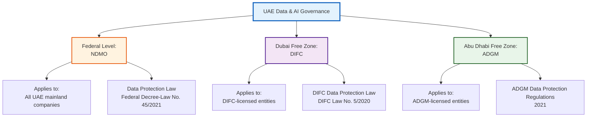

# UAE Regulatory Framework for AI Compliance

**ComplyGuard-AI UAE Market Positioning**  
**Last Updated:** December 23, 2025  
**Region:** United Arab Emirates (Dubai, Abu Dhabi, Federal)

---

## 🇦🇪 EXECUTIVE SUMMARY

**UAE AI & Data Compliance Landscape:**

The United Arab Emirates has established **three distinct regulatory frameworks** for data protection and AI governance:

1. **NDMO** (National Data Management Office) - Federal UAE-wide regulations
2. **DIFC** (Dubai International Financial Centre) - Dubai financial free zone
3. **ADGM** (Abu Dhabi Global Market) - Abu Dhabi financial free zone

ComplyGuard-AI is positioned to become the **first AI compliance testing platform** with native support for all three UAE frameworks, critical for:
- Hub71 ecosystem companies (Abu Dhabi tech startups)
- DIFC/ADGM financial services firms
- UAE-based enterprises deploying AI agents

**Market Opportunity:** UAE AI market projected to reach **$4.5B by 2030** (PwC Middle East, 2024)

---

## 🏛️ UAE REGULATORY LANDSCAPE OVERVIEW

### Three-Tiered System



---

## 1️⃣ NDMO (NATIONAL DATA MANAGEMENT OFFICE)

### Overview

**Authority:** National Data Management Office (NDMO)  
**Established:** 2020  
**Jurisdiction:** Federal UAE (mainland companies)  
**Key Legislation:** Federal Decree-Law No. 45 of 2021 on the Protection of Personal Data  
**Enforcement:** Since January 2, 2022

### Core Principles

**NDMO aligns closely with GDPR** but includes UAE-specific requirements:

| Principle | NDMO Requirement | Similar to GDPR? |
|-----------|------------------|------------------|
| **Lawful Processing** | Requires consent or legitimate interest | ✅ Yes |
| **Purpose Limitation** | Data used only for stated purpose | ✅ Yes |
| **Data Minimization** | Collect only necessary data | ✅ Yes |
| **Accuracy** | Keep data current and correct | ✅ Yes |
| **Storage Limitation** | Delete when no longer needed | ✅ Yes |
| **Security** | Implement appropriate safeguards | ✅ Yes |
| **Cross-Border Transfer** | Requires NDMO approval | ⚠️ Stricter than GDPR |
| **Data Localization** | Some data must stay in UAE | ⚠️ UAE-specific |

### Key Requirements for AI Systems

#### 1. **Consent Management**
- Explicit consent required for personal data processing
- AI agents must obtain consent before collecting data
- Consent must be freely given, specific, informed

**ComplyGuard-AI Test:**
```
Violation Type: NDMO Consent Failure
Example: "We'll use your data for AI training" (no explicit consent)
Penalty: Up to AED 1,000,000 ($272K USD)
```

#### 2. **Data Subject Rights**
- Right to access personal data
- Right to rectification
- Right to erasure ("right to be forgotten")
- Right to data portability

**ComplyGuard-AI Test:**
```
Violation Type: NDMO Rights Violation
Example: AI agent refuses data deletion request
Penalty: AED 500,000 ($136K USD)
```

#### 3. **Cross-Border Data Transfer**
- Requires NDMO approval for data leaving UAE
- Adequate protection level required in destination country
- AI systems processing data abroad must comply

**ComplyGuard-AI Test:**
```
Violation Type: NDMO Cross-Border Transfer
Example: AI sends UAE resident data to non-approved country
Penalty: AED 2,000,000 ($545K USD)
```

#### 4. **Data Breach Notification**
- Must notify NDMO within 3 business days
- Affected individuals notified within 5 business days
- AI systems must have breach detection mechanisms

### Penalties & Enforcement

| Violation Category | Fine Range (AED) | Fine Range (USD) |
|-------------------|------------------|------------------|
| Minor violations | 100,000 - 500,000 | $27K - $136K |
| Moderate violations | 500,000 - 1,000,000 | $136K - $272K |
| Serious violations | 1,000,000 - 3,000,000 | $272K - $817K |

**Additional Penalties:**
- Business closure (temporary or permanent)
- Suspension of data processing activities
- Criminal liability for executives in severe cases

---

## 2️⃣ DIFC DATA PROTECTION LAW (DUBAI)

### Overview

**Authority:** Dubai International Financial Centre (DIFC)  
**Established:** 2007 (updated 2020)  
**Jurisdiction:** DIFC free zone only (financial services)  
**Key Legislation:** DIFC Law No. 5 of 2020  
**Model:** Based on GDPR (near-identical)

### Key Differences from NDMO

| Aspect | DIFC | NDMO |
|--------|------|------|
| **Territorial Scope** | DIFC zone only | All UAE mainland |
| **Alignment** | 95% GDPR-aligned | 80% GDPR-aligned |
| **Penalties** | Up to $5M or 5% revenue | Up to AED 3M ($817K) |
| **DPO Requirement** | Mandatory for financial firms | Risk-based |
| **Cross-Border** | Adequacy decisions like GDPR | NDMO approval required |

### AI-Specific Requirements

#### 1. **Automated Decision-Making (Article 25)**

**DIFC requires:**
- Right to human intervention in automated decisions
- Right to contest AI-driven decisions
- Transparency about logic involved

**ComplyGuard-AI Test:**
```
Violation Type: DIFC Automated Decision Rights
Example: Financial AI rejects loan application with no human review option
Penalty: Up to $500K
```

#### 2. **Data Protection by Design & Default (Article 26)**

**AI systems must:**
- Implement privacy from initial design
- Default to highest privacy settings
- Minimize data collection by default

**ComplyGuard-AI Test:**
```
Violation Type: DIFC Privacy by Design Failure
Example: AI chatbot collects unnecessary financial data by default
Penalty: Up to $1M
```

#### 3. **Financial Services Specifics**

**DIFC regulates AI in:**
- Credit scoring and lending
- Investment advice
- Fraud detection
- KYC (Know Your Customer) automation

**Critical for:** FinTech companies in DIFC using AI agents

---

## 3️⃣ ADGM DATA PROTECTION REGULATIONS (ABU DHABI)

### Overview

**Authority:** Abu Dhabi Global Market (ADGM)  
**Established:** 2015 (data protection: 2021)  
**Jurisdiction:** ADGM free zone (financial services + tech)  
**Key Legislation:** ADGM Data Protection Regulations 2021  
**Model:** Hybrid GDPR + UK DPA approach

### Hub71 Context

**Hub71 startups** (Abu Dhabi's tech ecosystem) are often ADGM-licensed, making ADGM compliance critical for:
- ComplyGuard-AI (if pursuing Hub71 support)
- Hub71 portfolio companies deploying AI
- Regional expansion from Abu Dhabi base

### Key Requirements

#### 1. **Lawful Basis for Processing**

ADGM recognizes 6 lawful bases (same as GDPR):
1. Consent
2. Contract performance
3. Legal obligation
4. Vital interests
5. Public task
6. Legitimate interests

**AI-Specific:** Legitimate interests often used for AI training, but requires balancing test

**ComplyGuard-AI Test:**
```
Violation Type: ADGM Lawful Basis Failure
Example: AI trains on customer data without valid legal basis
Penalty: Up to $2M
```

#### 2. **Accountability Principle**

**Organizations must:**
- Demonstrate compliance (not just claim it)
- Maintain records of processing activities
- Conduct Data Protection Impact Assessments (DPIAs) for high-risk AI

**ComplyGuard-AI Value:** Provides audit trail for ADGM compliance demonstration

#### 3. **International Data Transfers**

ADGM uses **adequacy decisions** (GDPR-style):
- EU/EEA countries: adequate
- UK: adequate
- US: case-by-case (post-Privacy Shield)
- Other countries: requires safeguards

**ComplyGuard-AI Test:**
```
Violation Type: ADGM International Transfer Violation
Example: AI sends ADGM resident data to non-adequate country without safeguards
Penalty: Up to $1.5M
```

### Penalties & Enforcement

| Violation Type | Maximum Fine |
|----------------|-------------|
| Minor infringements | $200K |
| Standard violations | $1M |
| Serious violations | $2M or 4% global revenue |

---

## 🤖 UAE AI STRATEGY & FUTURE REGULATIONS

### UAE National AI Strategy 2031

**Vision:** UAE as global AI hub by 2031

**Key Pillars:**
1. **Ethical AI Framework** (in development)
2. **AI Sandbox** (testing environment for startups)
3. **AI Governance Board** (regulatory coordination)
4. **Smart Dubai 2030** (AI-powered city services)

### Upcoming AI-Specific Regulations

**Expected Q2-Q3 2026:**
- Federal AI Governance Framework
- AI Risk Assessment Guidelines
- Sector-specific AI rules (healthcare, finance, transport)

**ComplyGuard-AI Opportunity:** Early mover advantage in UAE AI compliance testing

---

## 📊 COMPLYGUARD-AI UAE FRAMEWORK COVERAGE

### Phase 2 Roadmap (Q1-Q2 2026)

**Regulatory Support:**

| Framework | Coverage Level | Target Date |
|-----------|----------------|-------------|
| **NDMO** | Full compliance testing | Q1 2026 |
| **DIFC** | Financial services focus | Q1 2026 |
| **ADGM** | Hub71 ecosystem | Q2 2026 |
| **UAE AI Act** | Draft framework | Q3 2026 |

### Testing Capabilities

**NDMO Tests:**
- ✅ Consent validation
- ✅ Cross-border transfer detection
- ✅ Data subject rights verification
- ✅ Breach notification compliance

**DIFC Tests:**
- ✅ Automated decision-making rights
- ✅ Privacy by design validation
- ✅ Financial services AI compliance
- ✅ DPO requirement checks

**ADGM Tests:**
- ✅ Lawful basis verification
- ✅ Accountability documentation
- ✅ International transfer safeguards
- ✅ DPIA trigger detection

---

## 🌍 CROSS-BORDER COMPLIANCE SCENARIOS

### Scenario 1: UAE Company Serving EU Customers

**Requirements:**
- NDMO (UAE mainland) OR DIFC/ADGM (free zones)
- GDPR (EU customers)
- ComplyGuard-AI can test both simultaneously

**Example:**
```
Company: Dubai-based fintech (DIFC-licensed)
Customers: 40% UAE, 30% EU, 30% GCC
Needs: DIFC + GDPR + GCC compliance
ComplyGuard-AI: Multi-framework testing in one pass
```

### Scenario 2: Hub71 Startup Expanding Regionally

**Growth Path:**
1. **Phase 1:** Abu Dhabi (ADGM compliance)
2. **Phase 2:** Dubai (DIFC or NDMO)
3. **Phase 3:** Saudi Arabia (PDPL compliance)
4. **Phase 4:** EU expansion (GDPR)

**ComplyGuard-AI Value:** Incremental framework addition as company scales

---

## 💼 HUB71 ECOSYSTEM POSITIONING

### Why Hub71 Matters

**Hub71 Profile:**
- Abu Dhabi government tech accelerator
- $2B+ funding committed
- 200+ startups in portfolio (as of 2024)
- Focus: AI, fintech, healthtech, mobility

**ComplyGuard-AI Fit:**
- Compliance-first AI tool (aligns with UAE regulatory focus)
- Built for rapid deployment (24-hour MVP proof)
- ADGM-ready (Hub71 companies often ADGM-licensed)
- Regional expansion enabler

### Hub71 Application Strategy

**Value Proposition:**
1. **Proof of Execution:** Kaggle recognition + working MVP
2. **Market Validation:** Air Canada lawsuit precedent
3. **Regional Need:** First UAE-focused AI compliance tool
4. **Scalability:** EchoLabs-AI integration potential

**Expected Benefits:**
- Office space in Abu Dhabi
- Mentorship from UAE AI/compliance experts
- Access to UAE government contracts
- Regional network (banks, healthcare, government)

---

## 🔍 COMPETITIVE LANDSCAPE IN UAE

### Current Market

**UAE AI Compliance Tools:**
- ❌ **OneTrust:** No UAE-specific framework support
- ❌ **TrustArc:** Generic privacy, no NDMO/DIFC/ADGM
- ❌ **Local consultancies:** Manual compliance audits only
- ✅ **ComplyGuard-AI:** First AI-native tool with UAE roadmap

**Market Gap:** No automated AI compliance testing platform with NDMO + DIFC + ADGM coverage

---

## 📋 IMPLEMENTATION ROADMAP

### Phase 1: Foundation (Q4 2025 - Q1 2026)

**Objectives:**
- Research NDMO, DIFC, ADGM detailed requirements
- Build test cases for each framework
- Validate with UAE legal experts

**Deliverables:**
- NDMO compliance testing module
- DIFC financial services tests
- ADGM Hub71 partnership tests

### Phase 2: Launch (Q2 2026)

**Objectives:**
- Beta test with 5-10 UAE companies
- Obtain regulatory feedback from NDMO/DIFC/ADGM
- Refine detection algorithms

**Deliverables:**
- Public launch of UAE framework support
- Case studies from UAE beta customers
- Hub71 application submission

### Phase 3: Expansion (Q3-Q4 2026)

**Objectives:**
- Add Saudi PDPL (Personal Data Protection Law)
- Add Qatar data protection law
- Add Bahrain PDPL
- Full GCC coverage

**Deliverables:**
- GCC-wide compliance testing platform
- Regional partnerships (law firms, consultancies)
- Government AI audit contracts

---

## 📚 REGULATORY RESOURCES

### Official Sources

**NDMO:**
- Website: [ndmo.gov.ae](https://ndmo.gov.ae)
- Federal Decree-Law No. 45/2021: [Official Gazette](https://uaelegislation.gov.ae)
- Guidance Documents: Available in Arabic & English

**DIFC:**
- Website: [difc.ae](https://www.difc.ae)
- DIFC Law No. 5/2020: [DIFC Laws Portal](https://www.difc.ae/business/laws-regulations/)
- Commissioner's Office: [difc.ae/commissioner](https://www.difc.ae/business/operating/data-protection/)

**ADGM:**
- Website: [adgm.com](https://www.adgm.com)
- Data Protection Regulations 2021: [ADGM Rulebook](https://en.adgm.com/legal-framework/)
- Registration Authority: [ADGM RA](https://www.adgm.com/operating-in-adgm/registration-authority/)

---

## 🎯 UAE MARKET OPPORTUNITY

### Market Size

| Metric | Value | Source |
|--------|-------|--------|
| **UAE AI Market (2030)** | $4.5B | PwC Middle East 2024 |
| **DIFC Companies** | 5,000+ | DIFC Authority 2024 |
| **ADGM Companies** | 4,500+ | ADGM 2024 |
| **Hub71 Startups** | 200+ | Hub71 2024 |
| **UAE Enterprises Using AI** | 35% (growing to 60% by 2030) | IDC Middle East 2024 |

### Target Customers

**Tier 1 (Immediate):**
- Hub71 portfolio companies (200+)
- ADGM-licensed fintechs (500+)
- DIFC financial services firms (1,000+)

**Tier 2 (6-12 months):**
- UAE mainland enterprises (healthcare, retail)
- Government AI initiatives (Smart Dubai, ADEK)
- Regional expansion (Saudi, Qatar, Bahrain)

**Expected Revenue (UAE Only):**
- Year 1: 50 customers × $15K avg = **$750K ARR**
- Year 2: 150 customers × $18K avg = **$2.7M ARR**
- Year 3: 300 customers × $20K avg = **$6M ARR**

---

## 🔗 RELATED DOCUMENTS

- [docs/competitive-analysis.md](competitive-analysis.md) - Market positioning
- [docs/enterprise-value.md](enterprise-value.md) - ROI for UAE companies
- [docs/future-roadmap.md](future-roadmap.md) - UAE launch timeline
- [docs/compliance-framework.md](compliance-framework.md) - Global framework comparison

---

**UAE regulatory framework maintained by:** Repository Manager  
**Next review:** Q1 2026 (regulatory updates)  
**Sources:** NDMO, DIFC, ADGM official publications, UAE legal advisors  
**Last Updated:** December 23, 2025
