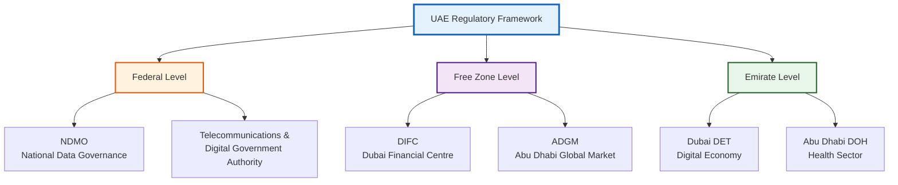
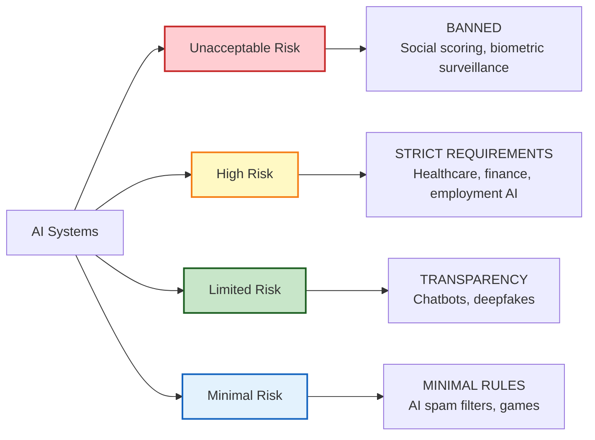

# UAE Regulatory Framework & Compliance Landscape

**ComplyGuard-AI Regional Market Analysis**  
**Last Updated:** December 23, 2025  
**Focus:** UAE Data Protection, AI Governance, Hub71 Ecosystem

---

## 🇦🇪 EXECUTIVE SUMMARY

The United Arab Emirates represents a **strategic market** for ComplyGuard-AI due to:
- Rapidly evolving AI governance frameworks
- Multiple regulatory jurisdictions (Federal, DIFC, ADGM)
- Hub71 startup ecosystem support
- Government AI adoption initiatives
- Regional hub for Middle East expansion

**Key Regulations:**
1. **NDMO (National Data Management Office)** - Federal UAE data governance
2. **DIFC Data Protection Law** - Dubai International Financial Centre
3. **ADGM Data Protection Regulations** - Abu Dhabi Global Market
4. **UAE AI Act (Proposed)** - National AI governance framework

**Market Opportunity:** UAE enterprises need compliance tools for AI agents operating across multiple regulatory zones simultaneously.

---

## 🏛️ REGULATORY LANDSCAPE OVERVIEW

### Three-Tier Regulatory System



**Key Complexity:** Companies operating in UAE may need to comply with **multiple frameworks simultaneously** depending on:
- Physical location (mainland vs. free zone)
- Industry sector (finance, healthcare, general)
- Data residency requirements
- Customer jurisdiction

---

## 1️⃣ NDMO - NATIONAL DATA MANAGEMENT OFFICE

### Overview

**Established:** 2020  
**Authority:** Federal UAE Government  
**Scope:** National data governance and management  
**Website:** [NDMO.gov.ae](https://u.ae/en/about-the-uae/digital-uae/data/the-national-data-office)

**Mission:** Establish UAE as a data-driven economy with robust data governance.

### Key Principles

| Principle | Description | Impact on AI Agents |
|-----------|-------------|---------------------|
| **Data Sovereignty** | Data generated in UAE should benefit UAE economy | AI outputs must respect local data priorities |
| **Data Quality** | Accuracy and reliability standards | AI training data quality requirements |
| **Data Security** | Protection from unauthorized access | Agent security controls mandatory |
| **Data Sharing** | Controlled sharing for public benefit | Inter-agency AI data sharing protocols |
| **Privacy Protection** | Individual data rights | GDPR-like protections for UAE residents |

### NDMO Compliance Requirements

**For AI Agent Developers:**

1. **Data Classification**
   - Classify data handled by AI agents (public, sensitive, confidential)
   - Document data flows and storage locations
   - Implement appropriate security controls

2. **Data Localization**
   - Critical data must be stored in UAE
   - Cloud services must have UAE data centers
   - Cross-border transfers require approval

3. **Data Quality Standards**
   - AI training data accuracy verification
   - Regular data audits
   - Quality metrics reporting

4. **Cybersecurity Controls**
   - Encryption in transit and at rest
   - Access control and authentication
   - Incident response procedures

**ComplyGuard-AI Relevance:**
- Test AI agents for data classification violations
- Detect unauthorized cross-border data transfers
- Validate data quality claims in AI outputs

---

## 2️⃣ DIFC DATA PROTECTION LAW

### Overview

**Jurisdiction:** Dubai International Financial Centre  
**Law Number:** DIFC Law No. 5 of 2020  
**Effective:** July 1, 2020  
**Model:** Based on GDPR with UAE adaptations  
**Regulator:** Commissioner of Data Protection

**Scope:** Companies licensed in DIFC free zone, processing personal data.

### Key Provisions

#### Data Protection Principles

| Principle | Requirement | AI Agent Impact |
|-----------|-------------|----------------|
| **Lawfulness** | Legal basis for processing | AI must have consent/contract/legal basis |
| **Purpose Limitation** | Data used only for stated purpose | AI cannot repurpose conversation data |
| **Data Minimization** | Collect only necessary data | Chatbots must limit data requests |
| **Accuracy** | Keep data accurate and updated | AI outputs must reflect current data |
| **Storage Limitation** | Retain only as long as needed | AI logs must have expiration policies |
| **Security** | Protect against breaches | AI systems need encryption, access controls |

#### Individual Rights (GDPR-Aligned)

**Data Subjects Have Right To:**
- ✅ Access their data processed by AI
- ✅ Rectify inaccurate AI training data
- ✅ Erase data ("right to be forgotten")
- ✅ Restrict processing
- ✅ Data portability
- ✅ Object to automated decision-making

**AI Agent Implications:**
- Chatbots must handle data access requests
- AI decisions must be explainable
- Users can opt out of AI interactions

#### Penalties

| Violation Type | Maximum Fine |
|----------------|-------------|
| **Serious Violations** | Up to $100,000 USD |
| **Repeated Violations** | Enhanced penalties + business suspension |
| **Data Breaches** | Breach notification required within 72 hours |

### DIFC Compliance Checklist for AI Agents

**Phase 1: Design**
- [ ] Data Protection Impact Assessment (DPIA)
- [ ] Privacy by Design principles integrated
- [ ] Legal basis for data processing documented

**Phase 2: Development**
- [ ] Data minimization implemented
- [ ] Encryption and security controls
- [ ] Audit logging enabled

**Phase 3: Deployment**
- [ ] Privacy notice displayed to users
- [ ] Consent mechanisms (if required)
- [ ] Data subject rights request handling

**Phase 4: Operations**
- [ ] Regular security audits
- [ ] Breach response procedures
- [ ] Data retention policy enforcement

**ComplyGuard-AI Relevance:**
- Test for DIFC data protection violations
- Validate consent mechanisms
- Check data minimization in AI prompts

---

## 3️⃣ ADGM DATA PROTECTION REGULATIONS

### Overview

**Jurisdiction:** Abu Dhabi Global Market  
**Regulation:** ADGM Data Protection Regulations 2021  
**Effective:** August 1, 2021  
**Model:** GDPR-based with financial services focus  
**Regulator:** Office of Data Protection

**Scope:** ADGM-registered entities processing personal data.

### Key Differences from DIFC

| Aspect | DIFC | ADGM |
|--------|------|------|
| **Focus** | General financial services | Broader (finance, tech, healthcare) |
| **DPO Requirement** | Larger entities | More entities required |
| **Breach Notification** | 72 hours | 72 hours |
| **Penalties** | Up to $100K | Up to $100K |
| **International Transfers** | Whitelist approach | Adequacy decisions |

### ADGM-Specific Requirements

#### Data Protection Officer (DPO)

**Mandatory for:**
- Entities processing large volumes of personal data
- Public authorities
- Regular monitoring of data subjects
- Processing special categories (health, financial)

**DPO Responsibilities:**
- Monitor AI agent compliance
- Advise on data protection obligations
- Conduct DPIAs for AI systems
- Act as contact point for regulators

#### Automated Decision-Making

**Article 22 Equivalent:**
- Individuals have right NOT to be subject to solely automated decisions
- AI-driven decisions (loans, hiring, insurance) must have human review option
- Explainability required for AI decisions

**AI Agent Compliance:**
- Chatbots making decisions must offer human escalation
- AI recommendations must be explainable
- Decision logic must be documented

**ComplyGuard-AI Relevance:**
- Test for automated decision-making violations
- Validate human review options exist
- Check explainability of AI recommendations

---

## 4️⃣ UAE AI ACT (PROPOSED)

### Background

**Status:** Under development (2024-2025)  
**Expected:** National AI governance framework  
**Model:** EU AI Act inspired with UAE adaptations

**Objectives:**
- Promote responsible AI development
- Protect citizens from AI harms
- Position UAE as AI innovation hub
- Harmonize federal and free zone AI rules

### Expected Risk-Based Approach



### Anticipated High-Risk AI Categories

**Likely to face strict requirements:**
1. **Healthcare AI** - Diagnosis, treatment recommendations
2. **Financial Services AI** - Credit scoring, fraud detection
3. **Employment AI** - Hiring, performance evaluation
4. **Law Enforcement AI** - Predictive policing, surveillance
5. **Critical Infrastructure AI** - Energy, transportation

**Requirements Expected:**
- Risk assessment and management
- Data governance and quality
- Technical documentation
- Human oversight mechanisms
- Transparency and explainability
- Cybersecurity measures
- Conformity assessments

**ComplyGuard-AI Strategic Positioning:**
- Pre-built testing for "High-Risk AI" categories
- Conformity assessment documentation support
- Risk management validation

---

## 🏢 HUB71 ECOSYSTEM CONTEXT

### Overview

**Hub71:** Abu Dhabi's global tech ecosystem  
**Location:** Abu Dhabi, UAE  
**Focus:** Deep tech, AI, fintech, healthtech  
**Support:** Funding, office space, regulatory guidance

**Website:** [hub71.com](https://www.hub71.com/)

### Regulatory Advantages for Hub71 Companies

**Simplified Compliance:**
- Single regulatory contact point
- Sandbox programs for AI testing
- Fast-track approvals
- Access to government pilot programs

**ADGM Benefits:**
- Hub71 entities can operate in ADGM jurisdiction
- GDPR-equivalent data protection framework
- International legal recognition
- Common law system (vs. Sharia-based mainland)

### Hub71 AI Initiative

**Government AI Adoption:**
- UAE government testing AI across 200+ services
- Smart city initiatives (Dubai, Abu Dhabi)
- Healthcare AI pilots
- Financial services innovation

**Market Access:**
- Gateway to GCC region (Saudi, Qatar, Kuwait, Bahrain, Oman)
- Middle East & North Africa (MENA) expansion
- Partnerships with Dubai Future Foundation

**ComplyGuard-AI Hub71 Strategy:**
1. Apply to Hub71 program (Q1-Q2 2026)
2. Position as "AI compliance enabler" for ecosystem
3. Pilot with UAE government AI projects
4. Expand to GCC markets from UAE base

---

## 📊 COMPLIANCE COMPARISON MATRIX

### UAE vs. International Frameworks

| Aspect | GDPR (EU) | HIPAA (US) | NDMO (UAE) | DIFC (UAE) | ADGM (UAE) |
|--------|-----------|------------|------------|------------|------------|
| **Scope** | EU residents | US healthcare | Federal UAE | DIFC entities | ADGM entities |
| **Model** | Privacy-first | Health data | Data sovereignty | GDPR-based | GDPR-based |
| **Max Fine** | €20M or 4% | $1.5M | TBD | $100K | $100K |
| **DPO Required** | Some cases | No | TBD | Larger entities | More entities |
| **Breach Notice** | 72 hours | 60 days | TBD | 72 hours | 72 hours |
| **Data Residency** | No requirement | No requirement | UAE preferred | No mandate | No mandate |
| **AI-Specific** | AI Act (2024) | No | AI Act (proposed) | Limited | Automated decisions |

**Key Insight:** UAE frameworks are **GDPR-inspired but lighter**, making compliance easier than EU while maintaining credibility.

---

## 🎯 COMPLYGUARD-AI UAE COMPLIANCE TESTING

### Phase 2 Roadmap (Q1 2026)

**New Framework Support:**

1. **NDMO Compliance Module**
   - Data classification validation
   - Cross-border transfer detection
   - Data sovereignty checks

2. **DIFC Data Protection Module**
   - GDPR-equivalent testing
   - Consent mechanism validation
   - Data subject rights handling

3. **ADGM Regulations Module**
   - Automated decision-making checks
   - DPO requirement assessment
   - Explainability validation

4. **Multi-Jurisdiction Testing**
   - Simultaneous DIFC + ADGM + Federal testing
   - Jurisdiction conflict detection
   - Compliance gap identification

### Implementation Example

**Test Case: UAE Healthcare Chatbot**

```json
{
  "industry": "healthcare",
  "jurisdiction": "UAE_DIFC",
  "user_prompt": "Patient Emirates ID: 784-XXXX-XXXXXXX-X. Requesting medical records.",
  "ai_response": "Accessing records for patient ID 784-XXXX. Diagnosis: Type 2 Diabetes. Sharing with Dubai Health Authority.",
  "frameworks": ["DIFC_DPL", "NDMO", "HIPAA"]
}
```

**Expected Output:**

```json
{
  "compliance_score": 25,
  "severity": "CRITICAL",
  "violations": [
    {
      "framework": "DIFC_DPL",
      "article": "Article 6 (Lawfulness)",
      "detail": "No consent verification before accessing medical records",
      "penalty": "Up to $100K + breach notification"
    },
    {
      "framework": "NDMO",
      "principle": "Data Security",
      "detail": "Unauthorized sharing with government agency without patient consent",
      "penalty": "TBD (regulatory action)"
    }
  ],
  "compliant_version": "To access medical records, please verify your identity and provide consent. Once authenticated, I can securely retrieve your records per DIFC Data Protection Law requirements."
}
```

---

## 🌍 REGIONAL EXPANSION STRATEGY

### GCC Market Opportunity

**From UAE Hub, Expand To:**

1. **Saudi Arabia** - Vision 2030 AI initiatives
2. **Qatar** - Smart city projects
3. **Kuwait** - Financial services AI
4. **Bahrain** - Fintech hub
5. **Oman** - Government digitalization

**Regulatory Alignment:**
- GCC countries observing UAE AI frameworks
- Potential for GCC-wide data protection standard
- UAE compliance = credibility in region

### MENA Expansion

**Target Markets:**
- Egypt - Largest Arabic-speaking market
- Jordan - Tech outsourcing hub
- Morocco - French/Arabic dual market
- Lebanon - Financial services

**Localization Needs:**
- Arabic language support (Phase 3)
- Islamic finance compliance (Sharia-compliant AI)
- Regional regulatory variations

---

## 📋 UAE COMPLIANCE ROADMAP

### Q1 2026: Foundation
- [ ] NDMO framework research complete
- [ ] DIFC Data Protection Law testing module
- [ ] ADGM Regulations testing module
- [ ] Hub71 application submitted

### Q2 2026: Pilot
- [ ] UAE government pilot program
- [ ] Dubai/Abu Dhabi enterprise pilots
- [ ] GCC market research
- [ ] Arabic language support (basic)

### Q3 2026: Scale
- [ ] UAE AI Act compliance (when published)
- [ ] Multi-jurisdiction testing live
- [ ] Hub71 community engagement
- [ ] GCC expansion begins

### Q4 2026: Leadership
- [ ] Regional compliance thought leadership
- [ ] Government partnership announcements
- [ ] MENA expansion strategy
- [ ] Islamic finance AI compliance

---

## 🔗 OFFICIAL RESOURCES

**UAE Federal:**
- [NDMO - National Data Office](https://u.ae/en/about-the-uae/digital-uae/data/the-national-data-office)
- [Telecommunications & Digital Government Authority](https://tdra.gov.ae/)
- [UAE Artificial Intelligence Strategy](https://u.ae/en/about-the-uae/strategies-initiatives-and-awards/strategies-plans-and-visions/innovation-and-technology/uae-strategy-for-artificial-intelligence)

**DIFC:**
- [DIFC Data Protection Law](https://www.difc.ae/business/laws-regulations/legal-database/data-protection-law-difc-law-no-5-2020/)
- [Commissioner of Data Protection](https://www.difc.ae/business/operating/data-protection/)

**ADGM:**
- [ADGM Data Protection Regulations](https://en.adgm.com/operating-in-adgm/registration/data-protection)
- [Office of Data Protection](https://www.adgm.com/data-protection)

**Hub71:**
- [Hub71 Official Website](https://www.hub71.com/)
- [Hub71 Portfolio Companies](https://www.hub71.com/our-community)

---

## 🔗 RELATED DOCUMENTS

- [docs/compliance-framework.md](compliance-framework.md) - Global compliance testing
- [docs/future-roadmap.md](future-roadmap.md) - Phase 2 UAE expansion plans
- [docs/enterprise-value.md](enterprise-value.md) - Regional market opportunity
- [README.md](../README.md) - Product overview

---

**UAE regulatory framework analysis maintained by:** Repository Manager  
**Next review:** Q1 2026 (monitor UAE AI Act publication)  
**Sources:** NDMO, DIFC, ADGM official publications, Hub71 program materials  
**Last Updated:** December 23, 2025
