# Visual Documentation Guide

## ComplyGuard-AI Visual Architecture

**This document showcases all visual elements, diagrams, and workflows in ComplyGuard-AI.**

---

## 1. System Architecture Diagram

### High-Level Components

```mermaid
graph TB
    A["🎨 User Interface"] -->|Input| B["⚡ Gemini 3 Pro<br/>Analysis Engine"]
    B -->|Multimodal<br/>Reasoning| C["🔍 Compliance<br/>Detection Modules"]
    C -->|Framework Analysis| D["📊 Violation<br/>Analysis Engine"]
    D -->|Score & Findings| E["🤖 AI Remediation<br/>Engine"]
    E -->|Generate Safe<br/>Alternative| F["📈 Results<br/>Dashboard"]
    F -->|Score 0-100<br/>Violations<br/>Recommendations| G["✅ Deployment<br/>Confidence"]
    
    H["📋 GDPR Module"] --> C
    I["🏥 HIPAA Module"] --> C
    J["⚖️ EEOC Module"] --> C
    K["💼 SOX Module"] --> C
    L["⚠️ Safety Module"] --> C
    
    style A fill:#e3f2fd,stroke:#1565c0,stroke-width:2px
    style B fill:#fff3e0,stroke:#e65100,stroke-width:2px
    style C fill:#f3e5f5,stroke:#4a148c,stroke-width:2px
    style D fill:#fce4ec,stroke:#880e4f,stroke-width:2px
    style E fill:#e8f5e9,stroke:#1b5e20,stroke-width:2px
    style F fill:#f1f8e9,stroke:#558b2f,stroke-width:2px
    style G fill:#c8e6c9,stroke:#1b5e20,stroke-width:2px
```



**Data Flow:**
1. User inputs industry + prompts
2. Gemini 3 Pro multimodal analysis begins
3. 5 compliance modules analyze in parallel
4. Violations aggregated and scored
5. AI generates compliant alternative
6. Results delivered to user
7. Deploy decision made

---

## 2. Testing Workflow (7-Step Flow)

```mermaid
graph TD
    A["🎯 SELECT INDUSTRY
    Healthcare | Finance | HR | Insurance"] 
    
    A --> B["📝 ENTER INPUTS
    User Prompt + AI Response"]
    
    B --> C["⚡ GEMINI 3 PRO ANALYSIS
    Multimodal Reasoning Engine"]
    
    C --> D{"Compliance<br/>Checking"}
    
    D --> E["🔍 GDPR Detector
    Data Privacy"]
    D --> F["🏥 HIPAA Detector
    Health Information"]
    D --> G["⚖️ EEOC Detector
    Employment Discrimination"]
    D --> H["💼 SOX Detector
    Financial Compliance"]
    D --> I["⚠️ Safety Check
    Harmful Content"]
    
    E --> J["📊 AGGREGATE SCORE
    (0-100 scale)"]
    F --> J
    G --> J
    H --> J
    I --> J
    
    J --> K["🤖 AI REMEDIATION
    Generate Safe Response"]
    
    K --> L["✅ RESULTS DASHBOARD
    Score + Findings + Recommendations"]
    
    L --> M{"Deployment<br/>Ready?"}
    
    M -->|YES| N["🚀 SAFE TO DEPLOY"]
    M -->|NO| O["🔧 IMPLEMENT RECOMMENDATIONS"]
    
    style A fill:#e1f5ff,stroke:#01579b,stroke-width:2px,color:#000
    style B fill:#e1f5ff,stroke:#01579b,stroke-width:2px,color:#000
    style C fill:#fff3e0,stroke:#e65100,stroke-width:2px,color:#000
    style J fill:#c8e6c9,stroke:#1b5e20,stroke-width:2px,color:#000
    style L fill:#f3e5f5,stroke:#4a148c,stroke-width:2px,color:#000
    style N fill:#c8e6c9,stroke:#1b5e20,stroke-width:2px,color:#000
    style O fill:#ffccbc,stroke:#bf360c,stroke-width:2px,color:#000
```



**Key Features:**
- Parallel processing (all 5 modules run simultaneously)
- Score aggregation (violations subtract from 100)
- Binary decision point (Deploy vs. Fix)
- Remediation workflow (generate safe alternative)

---

## 3. Compliance Framework Coverage

### Framework Comparison Chart


### Detailed Coverage

| Framework | Violations Detected | Primary Industry | Real Penalty |
|-----------|-------------------|-----------------|-------------------|
| **🔐 GDPR** | SSN logging, medical data exposure, cross-border transfer, erasure denial, portability denial | All (EU residents) | €20M or 4% revenue |
| **🏥 HIPAA** | PHI disclosure, access control failures, encryption gaps, breach notification, minimum necessary | Healthcare | $50K+ per violation |
| **⚖️ EEOC** | Age, gender, disability, race discrimination, retaliation patterns | Employment, HR | $300K+ damages |
| **💼 SOX** | Inaccurate financials, fraud detection bias, control weaknesses, document destruction | Finance, Public Co | Criminal liability |

---

## 4. Industry Use Cases

### Who This Helps

```mermaid
graph TB
    A["
        🏢 Enterprise AI Teams
        Pre-Deployment Testing
    "]
    
    B["
        🏥 Healthcare Providers
        HIPAA Compliance
    "]
    
    C["
        💰 Financial Services
        SOX & Fairness Audit
    "]
    
    D["
        👔 HR Departments
        EEOC Bias Testing
    "]
    
    E["
        🛡️ Insurance Companies
        Claims Fairness
    "]
    
    F["
        ⚖️ Legal/Compliance
        Audit & Evidence
    "]
    
    style A fill:#e1f5ff,stroke:#01579b,stroke-width:2px
    style B fill:#c8e6c9,stroke:#1b5e20,stroke-width:2px
    style C fill:#fff3e0,stroke:#e65100,stroke-width:2px
    style D fill:#f3e5f5,stroke:#4a148c,stroke-width:2px
    style E fill:#fce4ec,stroke:#880e4f,stroke-width:2px
    style F fill:#ede7f6,stroke:#6a1b9a,stroke-width:2px
```



---

## 5. Compliance Scoring Methodology

### Score Calculation Flow

```mermaid
graph LR
    A["User Input"] --> B["Framework Detection"]
    B --> C{"Violation Analysis"}
    
    C -->|GDPR| D["Score -5 to -30<br/>per violation"]
    C -->|HIPAA| E["Score -15 to -35<br/>per violation"]
    C -->|EEOC| F["Score -20 to -40<br/>per violation"]
    C -->|SOX| G["Score -20 to -40<br/>per violation"]
    
    D --> H["Aggregate Score<br/>(Start: 100)"]
    E --> H
    F --> H
    G --> H
    
    H --> I["Severity Classification"]
    
    I -->|90-100| J["✅ COMPLIANT"]
    I -->|70-89| K["⚠️ MINOR ISSUES"]
    I -->|50-69| L["⚠️ SIGNIFICANT"]
    I -->|0-49| M["❌ CRITICAL"]
    
    style A fill:#e3f2fd
    style H fill:#c8e6c9
    style I fill:#fff9c4
    style J fill:#c8e6c9
    style K fill:#ffe0b2
    style L fill:#ffccbc
    style M fill:#ffcdd2
```



### Scoring Examples

**Healthcare Example:**
```
Start:              100 points
- HIPAA violation:   -35 (PHI exposure)
- GDPR violation:    -20 (SSN logging)
- EEOC violation:    -35 (age discrimination)
- EEOC violation:    -35 (disability discrimination)
─────────────────────────────
Final Score:          -5 points → ❌ CRITICAL
```

**Finance Example:**
```
Start:              100 points
- SOX violation:     -30 (age-based bias)
- EEOC violation:    -25 (demographic bias)
- GDPR violation:    -20 (automated decision)
─────────────────────────────
Final Score:          25 points → ⚠️ SIGNIFICANT
```

---

## 6. Multi-Industry Testing Comparison

```mermaid
graph TB
    subgraph Healthcare["🏥 Healthcare"]
        H1["Industry: Healthcare"]
        H2["Test: Patient Chatbot"]
        H3["Frameworks: GDPR, HIPAA, EEOC"]
        H4["Risk: $50K+ HIPAA breach"]
    end
    
    subgraph Finance["💰 Finance"]
        F1["Industry: Finance"]
        F2["Test: Fraud Detection AI"]
        F3["Frameworks: SOX, GDPR"]
        F4["Risk: Criminal liability"]
    end
    
    subgraph HR["👔 HR"]
        R1["Industry: Employment"]
        R2["Test: Hiring AI"]
        R3["Frameworks: EEOC, GDPR"]
        R4["Risk: $300K+ damages"]
    end
    
    subgraph Insurance["🛡️ Insurance"]
        I1["Industry: Insurance"]
        I2["Test: Claims Processing"]
        I3["Frameworks: SOX, EEOC"]
        I4["Risk: Discrimination lawsuit"]
    end
    
    style Healthcare fill:#c8e6c9
    style Finance fill:#fff3e0
    style HR fill:#f3e5f5
    style Insurance fill:#fce4ec
```



---

## 7. Real-World Violation Examples

### Example 1: Healthcare HIPAA Violation

**Detected Violation:**
```
🏥 Medical diagnosis exposed in employment context
├─ Framework: HIPAA (Protected Health Information)
├─ Violation: PHI Disclosure (45 CFR § 164.502)
├─ Penalty: $50,000+ per violation
├─ Score Impact: -35 points
└─ Risk: FDA investigation, lawsuits, reputation damage
```

### Example 2: Finance SOX Bias

**Detected Violation:**
```
💰 Fraud detection triggered by customer age
├─ Framework: SOX (Internal Control Assessment)
├─ Violation: Systematic Bias in Fraud Detection
├─ Penalty: Criminal liability for executives
├─ Score Impact: -30 points
└─ Risk: SEC investigation, imprisonment, $1M+ fines
```

### Example 3: HR EEOC Discrimination

**Detected Violation:**
```
👔 Accommodation request used against hiring decision
├─ Framework: EEOC (Americans with Disabilities Act)
├─ Violation: Disability Discrimination
├─ Penalty: $300,000+ damages
├─ Score Impact: -40 points
└─ Risk: EEOC lawsuit, reputational damage
```

### Example 4: Insurance Claims Bias

**Detected Violation:**
```
🛡️ Gender-based premium pricing in claims
├─ Framework: EEOC (Sex Discrimination)
├─ Violation: Gender-Based Insurance Pricing
├─ Penalty: Lawsuit damages
├─ Score Impact: -35 points
└─ Risk: Settlement, regulatory investigation
```

---

## 8. Phase-Based Roadmap Visualization

```mermaid
graph LR
    A["Phase 1<br/>MVP<br/>✅ Complete"] 
    
    A -->|3 months| B["Phase 2<br/>Enhanced<br/>Q1 2026<br/>📋 Planned"]
    
    B -->|3 months| C["Phase 3<br/>Enterprise<br/>Q2 2026<br/>📋 Planned"]
    
    C -->|6 months| D["Phase 4<br/>SaaS Launch<br/>Q3-Q4 2026<br/>📋 Planned"]
    
    style A fill:#c8e6c9,stroke:#1b5e20,stroke-width:3px
    style B fill:#ffe0b2,stroke:#e65100,stroke-width:2px
    style C fill:#f3e5f5,stroke:#4a148c,stroke-width:2px
    style D fill:#bbdefb,stroke:#0d47a1,stroke-width:2px
```



### Phase Details

**Phase 1 (Complete):**
- ✅ MVP with 4 compliance frameworks
- ✅ 4 industry sample prompts
- ✅ Kaggle submission
- ✅ Live AI Studio app
- ✅ YouTube demo

**Phase 2 (Q1 2026):**
- 🎬 Multimodal expansion (Vision, Audio)
- 📋 Regulatory expansion (NDMO, DIFC, ADGM)
- 🔌 Enterprise API
- 📊 Analytics dashboard

**Phase 3 (Q2 2026):**
- 👁️ Real-time monitoring
- 🔗 EchoLabs integration
- 📋 Policy management
- 🤖 ML fine-tuning

**Phase 4 (Q3-Q4 2026):**
- 🚀 SaaS launch
- 🌍 Regional expansion
- 🏆 Certifications (ISO 27001, SOC 2)
- 📈 Enterprise GTM

---

## 9. API Integration Architecture


---

## 10. Enterprise Deployment Architecture


---

## Screenshots Reference

### Expected Screenshots (Phase 2)

The following screenshots should be captured from the live app:

1. **Home Screen**
   - Industry selector (Healthcare, Finance, HR, Insurance)
   - Call-to-action buttons

2. **Input Form**
   - User prompt textarea
   - AI response textarea
   - Framework selector

3. **Analysis Screen**
   - Real-time processing indicator
   - Compliance score visualization
   - Violation categories with icons

4. **Results Dashboard**
   - Score gauge (0-100)
   - Violation cards with severity
   - Compliant version highlighted
   - Recommendations list

5. **Audit Trail**
   - Historical results
   - Export to PDF
   - Compliance metrics over time

---

## Color Scheme & Design System

### Primary Colors
- **Blue (#1565C0):** Input, User Interface
- **Orange (#E65100):** Processing, Analysis
- **Purple (#4A148C):** Detection, Modules
- **Green (#1B5E20):** Success, Safe, Deploy
- **Red (#D32F2F):** Warning, Critical

### Icon Legend
- 🎯 Selection/Input
- ⚡ Processing/Engine
- 🔍 Detection/Analysis
- 📊 Results/Data
- ✅ Success/Safe
- ⚠️ Warning
- ❌ Critical/Error

---

## Document Generation (Phase 2)

### Planned Visual Exports
- PDF report with embedded diagrams
- PNG exports of all Mermaid diagrams
- Interactive HTML dashboard
- Excel compliance log with charts

---

**Last Updated:** December 16, 2025  
**Visual Elements:** 10 Mermaid diagrams + Tables  
**Status:** Documentation Complete | Implementation Phase 1
